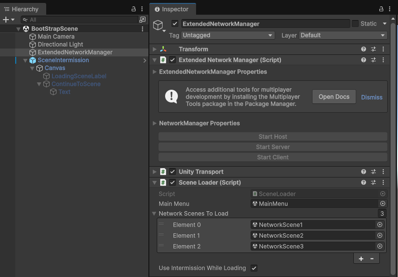
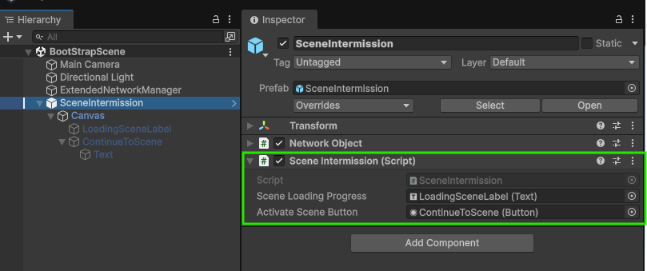
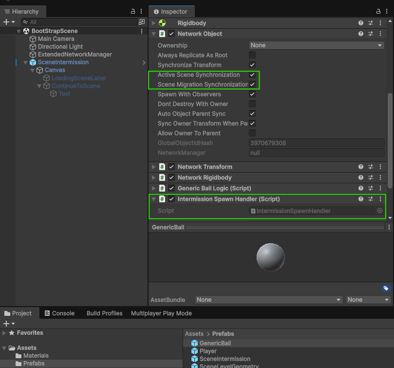

# Netcode for GameObjects   Pre-loading scenes and scene intermissions
_Supports using the client-server and distributed authority network topologies._

## Netcode components used

- NetworkSceneManager (Advanced)
  - Areas used:
    - OnSceneEvent processing
      - Using and adjusting SceneEvent.AsyncOperation
    - Client synchronization 
    - Scene loading and unloading.
- NetworkObject
  - Areas used:
    - Spawning & De-spawning
    - Active scene synchronization
    - Scene migration synchronization
- ExtendedNetworkManager : NetworkManager
  - Includes runtime menu selection based on selected network topology.
- Includes dynamically spawned and in-scene placed NetworkObjects.

## Getting Started

When you first open the project, you will want to load the BootStrapScene and then take a look at the ExtendedNetworkManager:

This has the SceneLoader component that includes a “Use Intermission” flag to enable/disable the intermission part. It also handles loading the scenes.

Next you will want to look at the SceneIntermission component:

This handles the whole allowSceneActivation part while also synchronizing clients with progress of loading and such.

Finally, you will want to look at the GenericBall prefab (what spawns when you hit the space bar) to see how that is handled… it basically will push the spawned instance to the DDOL if spawned while in the middle of a scene intermission (take note of this part).

## Building The Project
This example uses unity services. Upon loading the project for the first time, you will want to set your organization and create a new cloud project. This is the only required setting to create stand alone builds for this project.

## Terminology

### DDOL (Dont Destroy on Load)
(blurb)

### Pre-Loaded Scene:
Description covering the 90% done with the last step being the actual instantiation of all of the assets in the pre-loaded scene.

## Client Synchronization and Scene Validation
By combining these two scene management features, you can preload scenes to:

### Notes on Distributed Authority (?)

## Example Limitations
This example is primarily to provide a starting point for anyone interested in exploring how to override (customize) the scene loading and/or prefab instantiation. It does not cover all possible use case scenarios. It is recommended to explore this example, modify it, and read the [Netcode for GameObjects documentation](https://docs-multiplayer.unity3d.com/netcode/current/about/) for more details.

