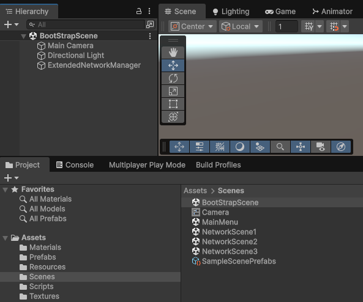
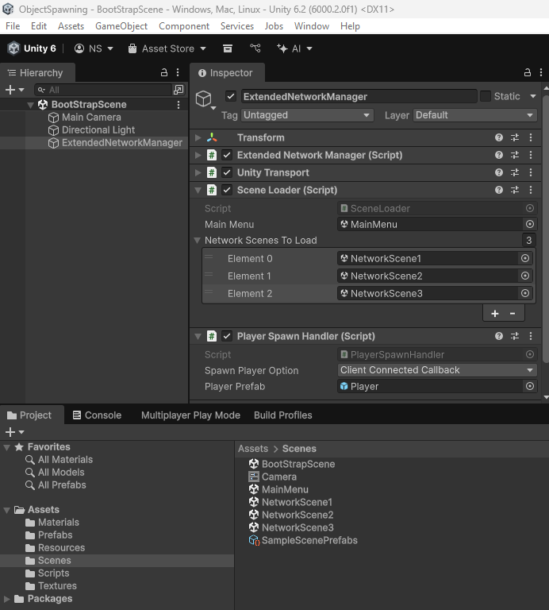
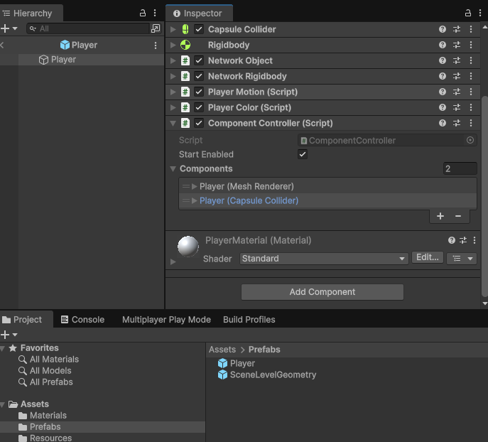
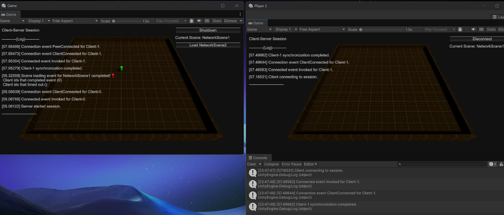
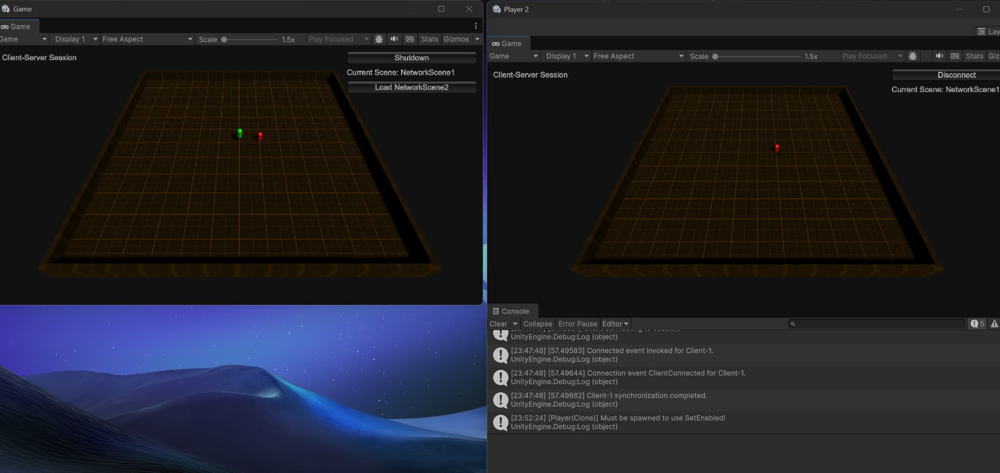
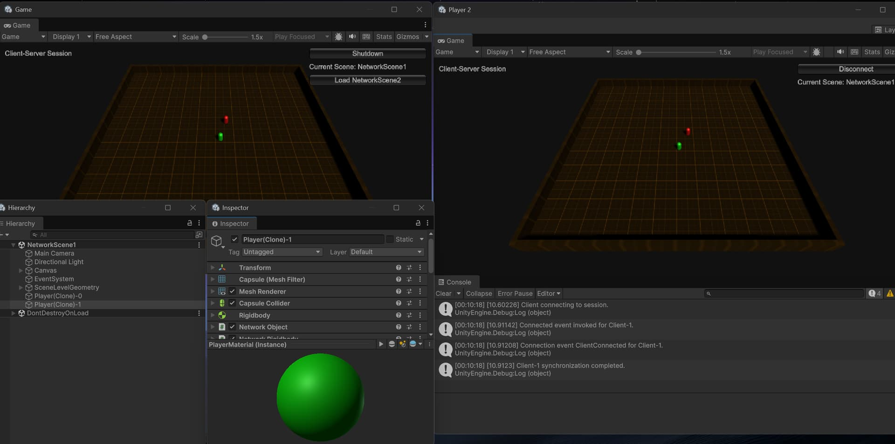
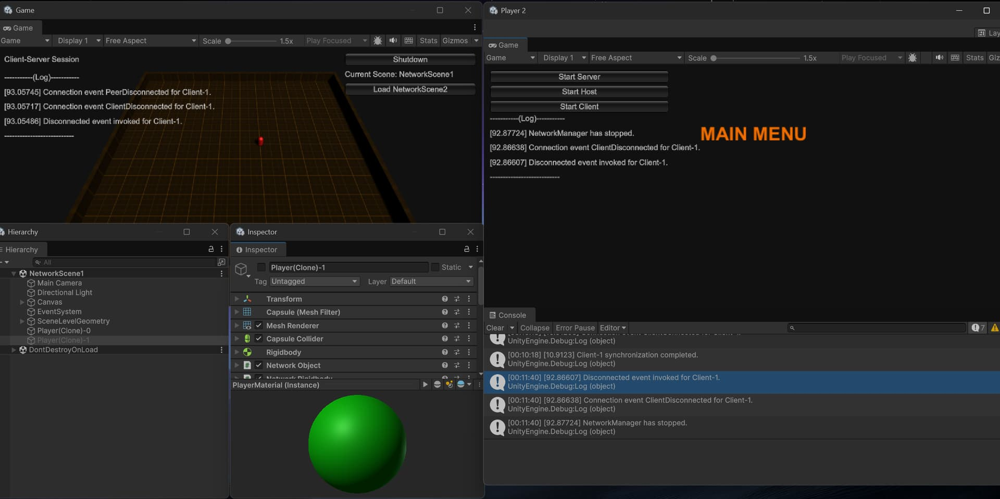
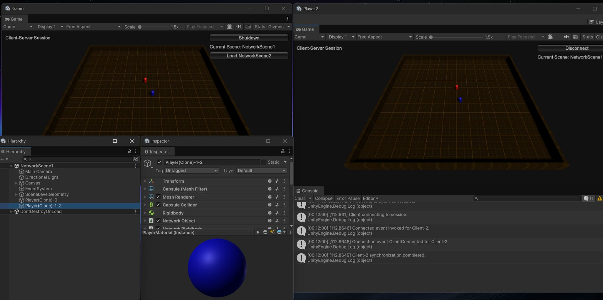
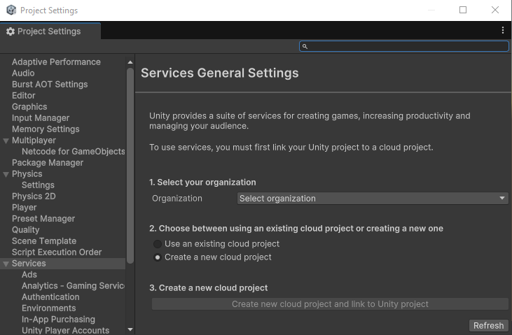

# Netcode for GameObjects   Spawning without observers
_Supports using the client-server and distributed authority network topologies._

## Netcode components used

- NetworkObject
  - Areas used:
    - Observers    
    - Spawning & De-spawning
- NetworkSceneManager
  - Areas used:
    - Client synchronization 
    - Scene loading and unloading.
- ExtendedNetworkManager : NetworkManager
  - Includes runtime menu selection based on selected network topology.
- Includes dynamically spawned and in-scene placed NetworkObjects.

## Getting Started (wip)

When you first open the project, you will want to load the BootStrapScene scene:

Then find the ExtendedNetworkManager.
The ExtendedNetworkManager in-scene placed object has two components of interest:

Scene Loader: A simple scene loading component that lets you add or remove scenes to be loaded.
Player Spawn Handler: This is where the majority of the spawning script of interest is located.

Next area of interest is the prefabs folder that includes a “Player” prefab:

The PlayerPrefab includes the newly introduced ComponentController NetworkBehaviour that allows one to control whether various components are enabled or disabled on a NetworkObject’s GameObject (or any child of) and have that all automatically synchronize all instances. I used this to handle the host (server) side when the owning player disconnects,

The things to note about object visibility is that once you take control over an object’s visibility for one or more client(s), you have then “turned off auto-pilot” (i.e. default behavior) and are now in full control over when it is or is not visible.

The other element here is the Dont Destroy With Owner setting. Once the owner client disconnects, (with a client-server topology) it will default ownership over to the host/server. The project attached above provides an additional behavior when the client disconnects by disabling the collider and the mesh renderer via the ComponentController.

When you enter into play mode, start a host and then join a client:

You will see the host spawns and has visibility of its object (red) and the client’s spawned object is visible on the host but not on the client.
At this point, you can use the Alpha0 - Alpha9 keys to toggle object visibility for a client’s spawned object (I didn’t add the ability to toggle on a per client basis, but you could extend this project to do that).

HItting the “0” (Alpha0) key when the editor instance has focus makes the host’s spawned object visibile to all connected clients (hitting it again hides it…except from itself…which you could use the ComponentController to handle this).

HItting the “1” (Alpha1) key when the editor instance has focus makes the client’s spawned object visible to all clients (including the owner) and hitting it again hides it.

If you disconnect the client, then the object remains but is disabled and added to a cache that is used for when the next client connects:

If you reconnect with the same virtual client, then the disabled instance is re-used but the client connecting has a different assigned client id (was 1 then chanted to 2 on 2nd connection). For example purposes only, I opted to leave in the “-#” at the end of the name of the object to see a short history of which client id owned that object instance while it persisted during the network session.

## Building The Project
This example uses unity services. Upon loading the project for the first time, you will want to set your organization and create a new cloud project. This is the only required setting to create stand alone builds for this project.

## The various uses of spawning with no observers

## Terminology

### Notes on Distributed Authority (?)

## Example Limitations
This example is primarily to provide a starting point for anyone interested in exploring how to override (customize) the scene loading and/or prefab instantiation. It does not cover all possible use case scenarios. It is recommended to explore this example, modify it, and read the [Netcode for GameObjects documentation](https://docs-multiplayer.unity3d.com/netcode/current/about/) for more details.

