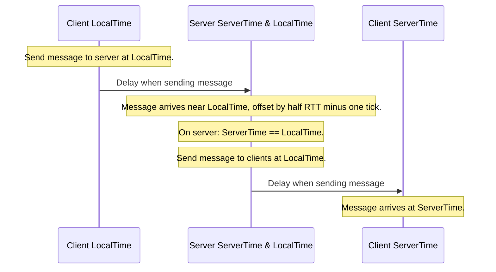
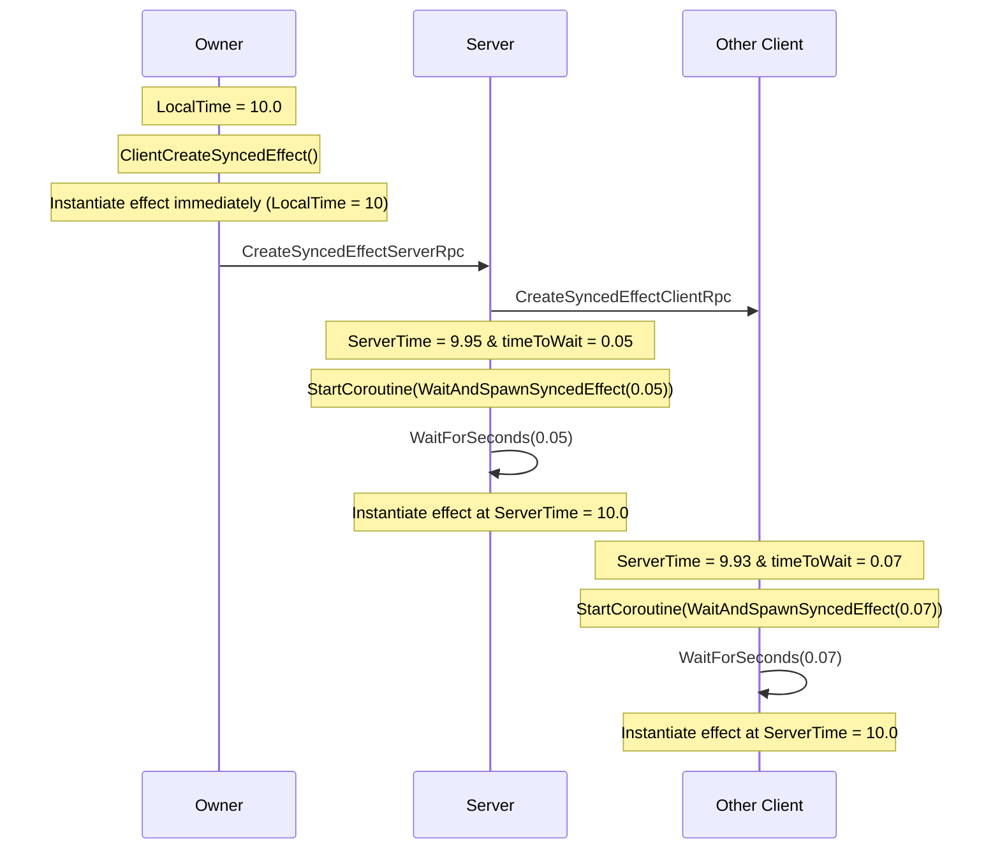

# Network time and ticks

Understand how Netcode for GameObjects calculates network time, and when to use local time or server time.

## Local time and server time

Netcode for GameObjects uses a star topology. That means all communications happen between the clients and the server or host, and never between clients directly. Messages take time to transmit over the network, so RPCs and `NetworkVariable` updates don't take effect immediately on other machines. Use `NetworkTime` to work with time while accounting for these transmission delays.

- `LocalTime` on a client is ahead of the server. It's the client's estimate of what the server clock reads right now: the last server time the client received, plus half the round trip time (RTT) to account for that message's own travel, plus a one-tick buffer.
- `ServerTime` on clients is behind the server. If the server sends a client RPC at `ServerTime`, the RPC arrives at roughly `ServerTime` on the clients.

> [!NOTE]
> `LocalTime` leads the server clock by a fixed one tick, and that lead doesn't scale with latency. A message a client sends at `LocalTime` therefore reaches the server exactly as the server clock reaches the same value only when the RTT is about two ticks, which is roughly 67 ms at the default tick rate of 30. On faster connections the message arrives before that point, and on slower connections after it. Don't use `LocalTime` to predict which server tick processes a given message. For the measured latency in ticks, use `NetworkTimeSystem.TickLatency`, which is based on the full RTT. To give outgoing messages more lead, increase `NetworkTimeSystem.LocalBufferSec`, as described in [Configure the network time system](#configure-the-network-time-system).



Use `LocalTime` in the following cases:

- For player objects with client authority.
- For a general time value.

Use `ServerTime` in the following cases:

- For player objects with server authority, for example by sending inputs to the server through RPCs.
- To stay in sync with position updates of the `NetworkTransform` component for all `NetworkObject` instances where the client isn't authoritative over the transform.
- For everything on `NetworkObject` instances that the client doesn't control.

## Network time examples

### Synchronize environments with network time

Many games have environmental objects that move in a fixed pattern. Use network time to move these objects without synchronizing their positions with a `NetworkTransform` component.

For example, the following code creates a moving elevator platform for a client-authoritative game:

```csharp
using Unity.Netcode;
using UnityEngine;

public class MovingPlatform : MonoBehaviour
{
    public void Update()
    {
        // Move up and down by 5 meters and change direction every 3 seconds.
        var positionY = Mathf.PingPong(NetworkManager.Singleton.LocalTime.TimeAsFloat / 3f, 1f) * 5f;
        transform.position = new Vector3(0, positionY, 0);
    }
}
```

### Create a synced event with network time

You don't usually need to align an effect precisely to time. However, for important effects or gameplay events, precise alignment improves consistency, especially for clients with poor network connections.

```csharp
using System.Collections;
using Unity.Netcode;
using UnityEngine;
using UnityEngine.Assertions;

public class SyncedEventExample : NetworkBehaviour
{
    public GameObject ParticleEffect;

    // Called by the client to create a synced particle event at its own position.
    public void ClientCreateSyncedEffect()
    {
        Assert.IsTrue(IsOwner);
        var time = NetworkManager.LocalTime.Time;
        CreateSyncedEffectServerRpc(time);
        StartCoroutine(WaitAndSpawnSyncedEffect(0)); // Create the effect immediately locally.
    }

    private IEnumerator WaitAndSpawnSyncedEffect(float timeToWait)
    {
        // Note sometimes the timeToWait will be negative on the server or the receiving clients if a message got delayed by the network for a long time. This usually happens only in rare cases. Custom logic can be implemented to deal with that scenario.
        if (timeToWait > 0)
        {
            yield return new WaitForSeconds(timeToWait);
        }

        Instantiate(ParticleEffect, transform.position, Quaternion.identity);
    }

    [Rpc(SendTo.Server)]
    private void CreateSyncedEffectServerRpc(double time)
    {
        CreateSyncedEffectClientRpc(time); // Call a client RPC to also create the effect on each client.
        var timeToWait = time - NetworkManager.ServerTime.Time;
        StartCoroutine(WaitAndSpawnSyncedEffect((float)timeToWait)); // Create the effect on the server but wait for the right time.
    }

    [Rpc(SendTo.ClientsAndHost)]
    private void CreateSyncedEffectClientRpc(double time)
    {
        // The owner already created the effect so skip them.
        if (IsOwner == false)
        {
            var timeToWait = time - NetworkManager.ServerTime.Time;
            StartCoroutine(WaitAndSpawnSyncedEffect((float)timeToWait)); // Create the effect on the client but wait for the right time.
        }
    }
}
```



> [!NOTE]
> Some components, such as `NetworkTransform`, add additional buffering. When you align an RPC event as in this example, add an extra delay.

## Network ticks

Network ticks run at a fixed rate. To set the tick rate, use the **Tick Rate** field on the NetworkManager component.

Changing the network tick rate affects when Netcode for GameObjects sends `NetworkVariable` changes. It doesn't send them immediately. Instead, it collects the changes during each network tick and sends them to other peers.

To run custom code once per network tick, before Netcode for GameObjects collects `NetworkVariable` changes, subscribe to the `Tick` event on the `NetworkTickSystem`.

```csharp
public override void OnNetworkSpawn()
{
    NetworkManager.NetworkTickSystem.Tick += Tick;
}

private void Tick()
{
    Debug.Log($"Tick: {NetworkManager.LocalTime.Tick}");
}

public override void OnNetworkDespawn() // don't forget to unsubscribe
{
    NetworkManager.NetworkTickSystem.Tick -= Tick;
}
```

> [!NOTE]
> When you use `FixedUpdate` or physics in your game, set the network tick rate to the same rate as the fixed update rate. To change the `FixedUpdate` rate, go to **Edit** > **Project Settings** > **Time** and set **Fixed Timestep**.

## Network fixed time

Use `FixedTime` to get a time value that represents the time during a network tick. This works in the same way as `FixedUpdate`, where `Time.fixedTime` represents the time during the `FixedUpdate`.

```csharp
public void Update()
{
    double time = NetworkManager.Singleton.LocalTime.Time; // time during this Update
    double fixedTime = NetworkManager.Singleton.LocalTime.FixedTime; // time during the previous network tick
}
```

## Network time precision

Netcode for GameObjects calculates network time values as double-precision floating-point values. This keeps time accurate on long-running servers. If your game server runs sessions for a long time, such as multiple hours or days, don't convert this value to a float. Always use doubles for time-related calculations.

For games with short play sessions, you can safely cast the time to a float or use `TimeAsFloat`.

## Configure the network time system

To change how Netcode for GameObjects calculates network time, configure the `NetworkTimeSystem`. Refer to [`NetworkTimeSystem`](xref:Unity.Netcode.GameObjects.Timing.NetworkTimeSystem) for information about the properties you can modify. You can safely adjust all properties at runtime. For example, increase the buffer values for a client with a poor connection.

> [!NOTE]
> Don't change the properties of the `NetworkTimeSystem` on the server or host. To change the behavior of the time system, change the values on the client instead.

## Additional resources

- [`NetworkTimeSystem` API reference](xref:Unity.Netcode.GameObjects.Timing.NetworkTimeSystem)
- [NetworkManager](../components/core/networkmanager.md)
- [NetworkTransform](../components/helper/networktransform.md)
- [NetworkVariable](../basics/networkvariable.md)
- [Remote procedure calls (RPCs)](message-system/rpc.md)
