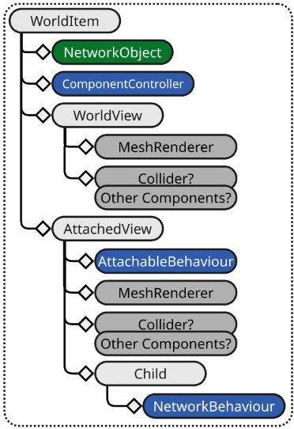
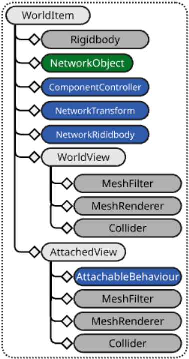
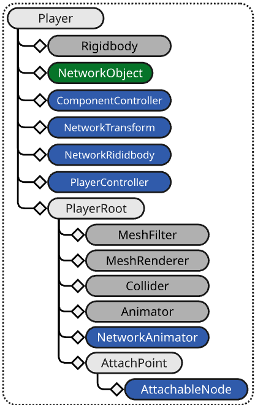
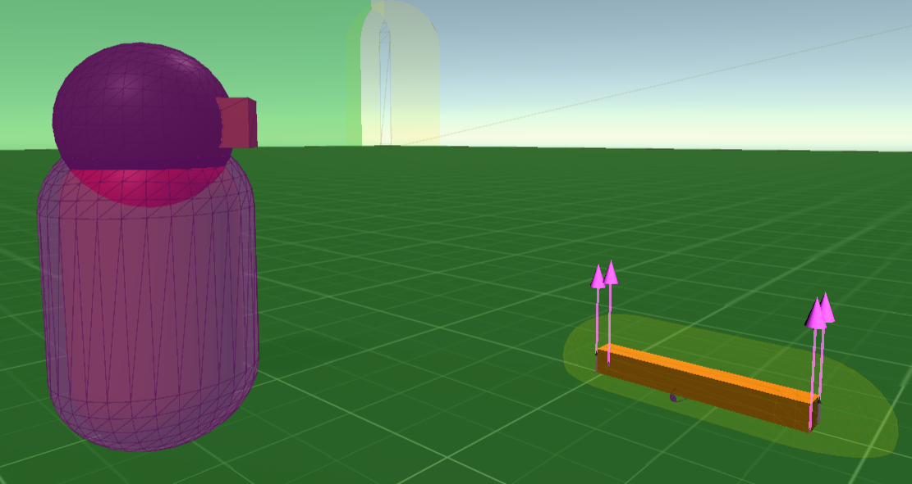
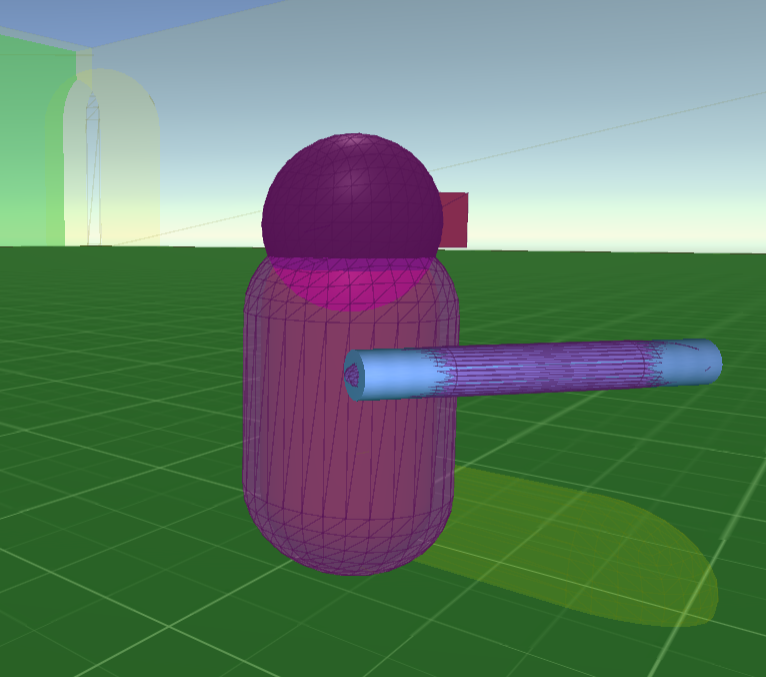
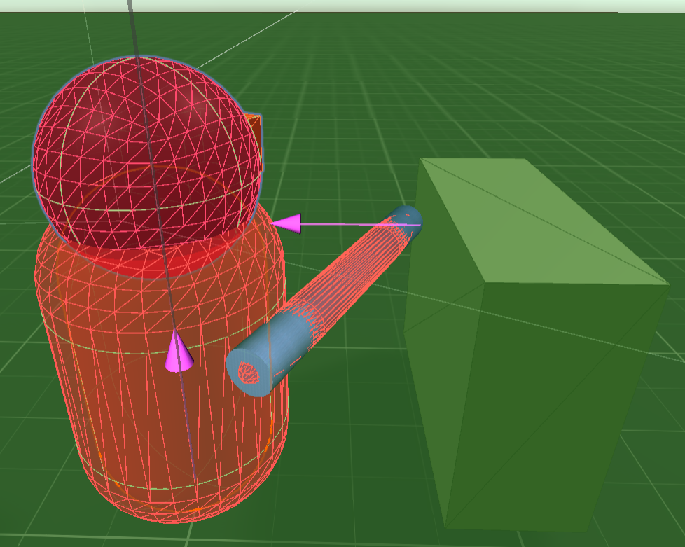
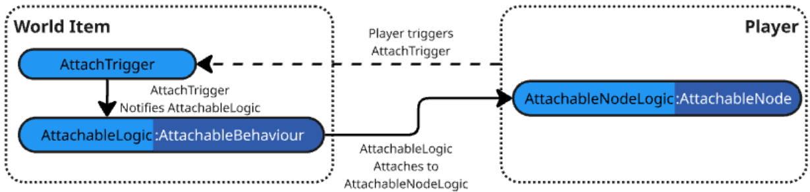
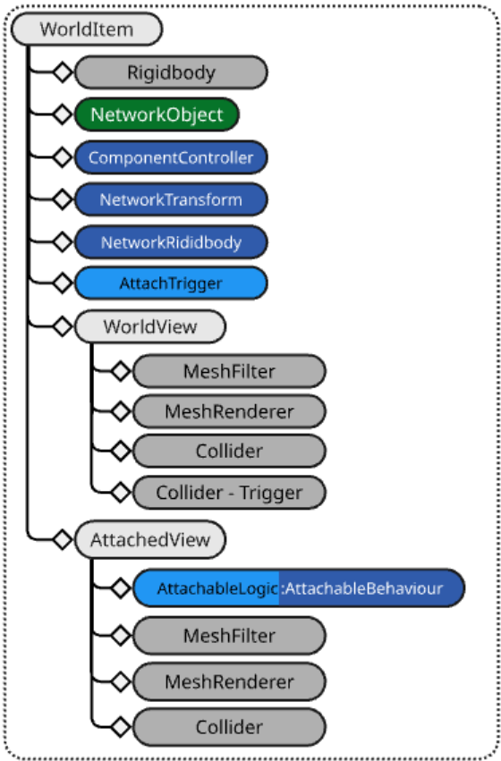
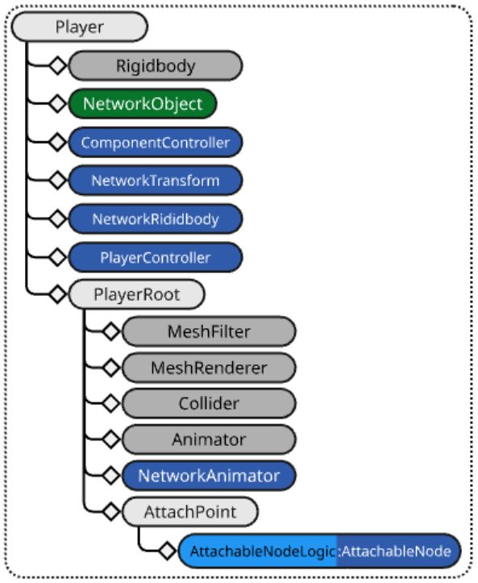

# Physics

There are many different ways to manage physics simulation in multiplayer games. Netcode for GameObjects (Netcode) has a built in approach which allows for server-authoritative physics where the physics simulation only runs on the server. To enable network physics, add a NetworkRigidBody component to your object.

## Physics and latency

A common issue with physics in multiplayer games is lag and how objects update on basically different timelines. For example, a player would be on a timeline that's offset by the network latency relative to your server's objects. One way to prepare for this is to test your game with artificial lag. You might catch some weird delayed collisions that would otherwise make it into production.

The best way to address the issue of physics latency is to create a custom NetworkTransform with a custom physics-based interpolator. You can also use the [Network Simulator tool](https://docs.unity3d.com/Packages/com.unity.multiplayer.tools@latest?subfolder=/manual/network-simulator) to spot issues with latency.

## Message processing vs. applying changes to state (timing considerations)

When handling the synchronization of changes to certain physics properties, it's important to understand the order of operations involved in message processing relative to the update stages that occur within a single frame. The stages occur in this order:

- Initialization _(Awake and Start are invoked here)_
- EarlyUpdate _(Inbound messages are processed here)_
- FixedUpdate _(Physics simulation is run and results)_
- PreUpdate _(NetworkTime and Tick is updated)_
- Update _(NetworkBehaviours/Components are updated)_
- PreLateUpdate: _(Useful for handling post-update tasks prior to processing and sending pending outbound messages)_
- LateUpdate: _(Useful for changes to camera, detecting input, and handling other post-update tasks)_
- PostLateUpdate: _(Dirty NetworkVariables processed and pending outbound messages are sent)_

From this list of update stages, the `EarlyUpdate` and `FixedUpdate` stages have the most impact on NetworkVariableDeltaMessage and RpcMessages processing. Inbound messages are processed during the `EarlyUpdate` stage, which means that Rpc methods and NetworkVariable.OnValueChanged callbacks are invoked at that point in time during any given frame. Taking this into consideration, there are certain scenarios where making changes to a Rigidbody could yield undesirable results.

## Parenting and Rigidbody

Since PhysX has no concept of local space, it can become a challenge to  synchronizing two rigid bodies. Luckily, there are two potential solutions to handling this:

- Use a [Joint](https://docs.unity3d.com/6000.2/Documentation/ScriptReference/Joint.html):
  - The [Social Hub demo](https://github.com/Unity-Technologies/com.unity.multiplayer.samples.bitesize/tree/main/Basic/DistributedAuthoritySocialHub) project provides an example of using a `FixedJoint`.
    - _This is a more complicated path to take._
- Use [AttachableBehaviour](../components/helper/attachablebehaviour.md) to handle this for you.
  - While this does require some initial prefab hierarchical organization, this approach will yield faster and more consistent results, but does not cover all physics based parenting scenarios (_but does cover a lot of them_).

## AttachableBehaviour vs Joint
  
_How does one determine which approach to take?_

With physics things can become a bit more complicated as there are certain features you might use one way when making a single player project but will want to avoid using with a netcode enabled project. This is especially true if using `NetworkTransform` and `NetworkRigidbody` that has [NetworkRigidbody.UseRigidBodyForMotion](https://docs.unity3d.com/Packages/com.unity.netcode.gameobjects@2.5/api/Unity.Netcode.Components.NetworkRigidbodyBase.html#Unity_Netcode_Components_NetworkRigidbodyBase_UseRigidBodyForMotion) enabled. As such, it might be best to start out with a project design requirement and walk through the logical steps one might take to prototype the required feature while discussing some of the common pitfalls one could encounter.

### The world item example (AttachableBehaviour)
Your project's game design includes world items that players can pick up. 
The world item's design requirements are:
- Each world item should be impacted by physics when picked up or not.
- When not picked up, the world item acts like a normal physics object.
- When picked up, it should:
 - Add to the player's over-all mass.
 - Extend the collision boundary of the player.
   - The design requires the picked up item to ignore the item's colliders but cause the player's rigid body to react (collide) based on any iteractions the item might have with other physics world objects.
- The implmentation should be modular and easy to customize by both level designers and scripting programmers.

As the team's netcode engineer, your first instinct might be to use __NetworkObject__ parenting and just parent the world item under the player at the desired child generation level within the player's over-all root-child hierarchy. However, when prototyping this approach you quickly discover that the player's rigid body fights with the (picked up / parented) world item's rigid body causing a strange "jitter" on the world item when the player moves and perhaps animates. 

After investigating the issue further, you discover this same kind of fighting between two rigid bodies can also happen when making a single player game and trying to synchronize multiple rigid bodies under a single root rigid body. In order to provide some form of constraint on the child rigid body you might use something like a physics [Joint](https://docs.unity3d.com/6000.2/Documentation/ScriptReference/FixedJoint.html).

> [!NOTE]
> This is a viable path to take. There are scenarios where it might be more useful if the player's rigid body just started taking into consideration the collision and physics material of the item being parented. It actually might even be more useful to not even have the child's rigid body active while the item is picked up. Since you cannot enable or disable a rigid body, the most common soluton is to make the rigid body kinematic. However, using this approach with Netcode for GameObjects could become a bit more complicated.
>
> Netcode for GameObjects uses the kinematic feature of Unity's __Rigidbody__ and __Rigidbody2d__ to dictate who has "physics authority". The authority is non-kinematic which allows physics to impact the object's velocities, collide with other bodies, and have various forces applied (frictional or otherwise). Non-authority instances are kinematic and synchronize the motion of the authority's non-kinematic body via [NetworkTransform](../components/helper/networktransform.md) or writing your own custrom transform synchronizing NetworkBehaviour based script.

## When a physics joint might be a better path

If your requirements vary from the [above world item example](#the-world-item-example-attachablebehaviour), then answering the following questions should help further guide you to the recommended approach:

- Does your child physics object need to interact with other child physics objects?
  - Do the interactions involve collisions between the children under the parent?
  - Does each child, under the same parent, require having physics driven velocities independent of, but relative to, the parent?
  - Were you planning on using a physics joint (like a [SpringJoint](SpringJoint)) anyway?

If you answered "yes" to one or more of those questions, then you most like will want to use the physics joint approach.

If you only answered yes to the collision part and are just wanting the colliders of the child or children to extend the player's collision volume/area, then using an `AttachableBehaviour` would be the recommended path to take.

## Using AttachableBehaviour for parenting physics objects

> [!NOTE]
> If you haven't already done so, it is highly recommended you read over the [AttachableBehaviour](../components/helper/attachablebehaviour.md) documentation in order to better understand the attachable process before proceeding.

_Continuing the task to meet the [project's world item's requirements](#the-world-item-example-attachablebehaviour), it is determined that this specific feature does not meet the requirements of using a physics joint. It does not require any child object interactions nor does it require the child object to have independent, physics driven, velocities that are relative to the player's motion so it is a good candidate to leverage from the attachables approach to implement the world item feature for your project. The next steps are figuring out how to do this._


Taking the __AttachableBehaviour__ approach provides all of the functionality you need to easily handle parenting only a portion of an object underneath another physics object as it will:
- Allow the world item to have physics applied when picked up or dropped/placed in the world somewhere.
- Extend the player's collision boundary and if the collider has a physics material applied it will be used when it collides with other non-kinematic bodies.
  - _A `Rigidbody` will update its "known colliders" when an object is parented underneath it._

Starting with the [AttachableBehaviour](../components/helper/attachablebehaviour.md) world item diagram:



Making some finalizations on the components you would use might initially look something like this:



The world item has been further defined by including the following components:
- On the root prefab __GameObject__:
  - Added a __Rigidbody__.
  - Added a __NetworkTransform__.
  - Added a __NetworkRigidbody__.
- On the __AttachedView GameObject__:
  - Added a __Collider__.

The logical flow is:
- When the world item is not picked up, the __MeshRenderer__ and __Collider__ are disabled on the __AttachedView__.
- When the world item is picked up (attached), the previously mentioned __AttachedView__'s disabled components are enabled while the __MeshRenderer__ and __Collider__ are disabled on the __WorldView__.

The next step is to determine what kind of adjustments you might want to make on your player prefab. Relative to the [AttachableBehaviour player prefab diagram](../components/helper/attachablebehaviour.md#player), your end result might look something close to this:



Where your project doesn't require a left or right hand position but just a single location to attach your items (__AttachPoint__) which has an [AttachableNode](../components/helper/attachablenode.md) component.

_Reviewing over the [project's world item's requirements](#the-world-item-example-attachablebehaviour), there is no requirement to independently move the item and it makes more sense to let the animation and player's motion drive the position of the item at any given moment since both are already synchronized between instances._

> [!NOTE]
> By adding a __NetworkTransform__ that synchronizes in local space to the attach point you could introduce a smooth transition to picking something up. You would want to teleport the AttachPoint, in local space, to the location of the item being picked up. You can get the local space player relative position by performing an inverse transform point by using the player's transform to transform the world space position of the item being picked. You would need some script to handle the motion of the item to the player.

### Rigidbody and nested child colliders

Below is a screenshot of a prototype world item that, when the player (capsule) runs over the item a collider trigger invokes the `OnTriggerEnter` callback that attaches the __AttachedView__ to an __AttachableNode__. Prior to triggering the attach event, they are viewed as two unique non-kinematic physics objects:


However, once the item is "picked up" and the __AttachedView__ parented under the __AttachPoint__ the player's rigid body starts including the __AttachedView__'s collider and (if set) the physics material assigned to the collider in its physics updates:



When moving the player around, if there is another physics object or static collider (world geometry) that impacts the collider on the now parented __AttachedView__, if using the physics debugger you can see that the player's __Rigidbody__ is detecting the collision:



It is this core mechanic that is leveraged when using the  __AttachableBehaviour__ approach to parenting physics objects under physics objects and removes the more complex (to synchronize) physics joint approach.


### Bringing it all together

_Reviewing over the [project's world item's requirements](#the-world-item-example-attachablebehaviour), you have almost all of the elements you need to complete the world item feature, but you are not combining the mass and it seems that when you pick up the world item (the child __AttachView__) you notice the root world item starts to fall endlessly._

The final step to complete the world item feature is to address the last three requirements:

- Write some script to make sure the parent __WorldItem__ stays in place when __AttachView__ is attached to a player.
  - This requires knowing when the item is being attached and detatched.
- Write some script to combine the world item's mass with the player's mass.
  - This too requires knowing when the item is being attached and detatched.
- Write a script that handles detecting player entering the trigger collider to parent the object.

The high level logical flow would look something like this:



Where:
- __AttachTrigger__: Derives from __NetworkBehaviour__, this class handles detecting a player within a pre-deinfed "pickup" collider configured as a trigger.
- __AttachableLogic__ : Derives from __AttachableBehaviour__ in order to leverage from the virtual method `AttachableBehaviour.OnAttachStateChanged` that is invoked when the attachable is attaching, attached, detatching, and detatched.
- __AttachableNodeLogic__: Derives from __AttachableNode__ in order to leverage from the virtual method `AttachableNode.OnOnDetached` that is invoked when the attachable is detatched from the player.

From the above diagram we can see that as the player's collider moves into the __World Item__'s collider configured as a trigger it will notify the __AttachableLogic__ which, in turn, attaches the __AttachedView__ to the __AttachableNodeLogic__.

With the above additional modifications, our __World Item__ now would look like this:



- The __AttachTrigger__ is added to handle the trigger event.
  - This requires another collider placed on the __WorldView__ so while the item is not picked up it will trigger when the player's collider enters the __Collider - Trigger__. When attached, the __MeshRenderer__, __Collider__, and __Collider - Trigger__ are all disabled.
- The __AttachableLogic__ takes the place of the first pass __AttachableBehaviour__.

The __Player__ requires a minor adjustment:


- The __AttachableNode__ is updated to the new derived class __AttachableLogic__.

### The scripts

_Reviewing over the [project's world item's requirements](#the-world-item-example-attachablebehaviour), you have all of the elements you need to complete the world item feature. The next task is to determine what your scripts might look like._


__AttachTrigger__<br />
Below is the example script for this:
```c#
using Unity.Netcode;
using UnityEngine;

/// <summary>
/// Placed on the world item, this will attempt to attach the AttachedView to the 
/// player's AttachableNode.
/// </summary>
public class AttachTrigger : NetworkBehaviour
{
    [Tooltip("The amount of time to wait before allowing the same owner to re-trigger this instance")]
    public float SameOwnerDelay = 0.5f;
    private float m_LastTriggerTime = 0.0f;
    private AttachableLogic m_AttachableLogic;
    private GameObject m_LastPlayerToAttach;

    private void Awake()
    {
        // Find the AttachableBehaviour
        m_AttachableLogic = transform.parent.GetComponentInChildren<AttachableLogic>();
    }

    /// <summary>
    /// Used to help prevent from an item re-attaching when dropped by the player
    /// </summary>
    public void SetLastUpdateTime()
    {
        var previousLast = m_LastTriggerTime;
        m_LastTriggerTime = Time.realtimeSinceStartup + SameOwnerDelay;
    }


    private void OnTriggerEnter(Collider other)
    {
        if(!enabled || !m_AttachableLogic)
        {
            return;
        }

        // Don't retrigger immediately to avoid picking up the object as we drop it.
        if (other.gameObject == m_LastPlayerToAttach && m_LastTriggerTime > Time.realtimeSinceStartup)
        {
            return;
        }

        // Attach the item to the player
        if (m_AttachableLogic.Triggered(other))
        {
            m_LastPlayerToAttach = other.gameObject;
            SetLastUpdateTime();
        }
    }
}
```
A relatively simple scrip that includes a "trigger delay" to assure if the object is dropped it does not immediately re-attach itself to the player.

__AttachableLogic__<br />
Below is the example script for this:
```c#
using Unity.Netcode;
using Unity.Netcode.Components;
using UnityEngine;

public class AttachableLogic : AttachableBehaviour
{
    public Rigidbody Rigidbody => m_InternalRigidbody;
    private Rigidbody m_InternalRigidbody;
    private NetworkTransform m_InternalNetworkTransform;

    private TagHandle m_PlayerTag;

    protected override void Awake()
    {
        base.Awake();
        // Get the world item's Rigidbody
        m_InternalRigidbody = transform.root.GetComponent<Rigidbody>();
        // Get the world item's NetworkTransform
        m_InternalNetworkTransform = transform.root.GetComponent<NetworkTransform>();
        // Use tags to filter what triggers the parenting
        m_PlayerTag = TagHandle.GetExistingTag("PlayerTag");
    }

    /// <summary>
    /// Invoked by <see cref="AttachTrigger"/>
    /// </summary>
    /// <param name="other">the collider that caused the trigger event.</param>
    /// <returns></returns>
    public bool Triggered(Collider other)
    {
        // Don't trigger if the world item is not spawned, is attached or is being attached,
        // or something other than the player caused the trigger event.
        if (!IsSpawned || m_AttachState != AttachState.Detached || !other.CompareTag(m_PlayerTag))
        {
            return false;
        }

        // We can only attach to an AttachableNode. Make sure we can find at least one AttachableNode.
        var attachableNode = other.gameObject.GetComponentInChildren<AttachableNodeLogic>();

        // Do not attempt to attach if there is no available AttachableNode, this is not the local player,
        // or the player is already carrying something (this could be configured for a specific world item type).
        if (!attachableNode || !attachableNode.IsLocalPlayer || attachableNode.HasAttachments)
        {
            return false;
        }

        // If using a distributed authority topology, go ahead and make the local player's client the authority
        // (owner) of the world item/
        if (NetworkManager.DistributedAuthorityMode && OwnerClientId != attachableNode.OwnerClientId)
        {
            NetworkObject.ChangeOwnership(attachableNode.OwnerClientId);
        }

        // Attach the object
        Attach(attachableNode);
        return true;
    }

    /// <summary>
    /// Invoked when the attachable is attaching, attached, detatching, and detatched.
    /// </summary>
    protected override void OnAttachStateChanged(AttachState attachState, AttachableNode attachableNode)
    {
        if (!HasAuthority || !attachableNode)
        {
            return;
        }
        switch (attachState)
        {
            case AttachState.Detached:
                {
                    // Always get the NetworkObject's transform as it could be parented under another NetworkObject
                    // Position the item slightly forward, to the right, and up of the player
                    var newPosition = attachableNode.NetworkObject.transform.position + attachableNode.NetworkObject.transform.forward * 2.0f + attachableNode.NetworkObject.transform.right * 2.0f + attachableNode.transform.root.up * 2.0f;

                    // Rotate relative to the player
                    var newRotation = attachableNode.NetworkObject.transform.rotation;

                    if (m_InternalRigidbody)
                    {
                        // Assure there is no existing velocities
                        m_InternalRigidbody.linearVelocity = Vector3.zero;
                        m_InternalRigidbody.angularVelocity = Vector3.zero;
                        // Prepare Rigidbody for being in "world view mode".
                        if (m_InternalRigidbody.IsSleeping())
                        {
                            m_InternalRigidbody.WakeUp();
                        }
                        // Re-enabled gravity
                        m_InternalRigidbody.useGravity = true;
                    }

                    // Re-position the world item to the current location of the AttachedView
                    m_InternalNetworkTransform.SetState(newPosition, newRotation, teleportDisabled: false);
                    break;
                }
            case AttachState.Attaching:
                {
                    if (m_InternalRigidbody)
                    {
                        // Disabled gravity (i.e. don't fall through the world)
                        m_InternalRigidbody.useGravity = false;
                        // Assure all velocities are zeroed out
                        m_InternalRigidbody.linearVelocity = Vector3.zero;
                        m_InternalRigidbody.angularVelocity = Vector3.zero;
                        // Sleep the rigid body.
                        m_InternalRigidbody.Sleep();
                    }
                    break;
                }
        }
        base.OnAttachStateChanged(attachState, attachableNode);
    }

    /// <summary>
    /// Invoked when the item is detatched to provide some motion to the item.
    /// </summary>
    /// <param name="throwForce">amount of impulse force to apply</param>
    public void Throw(Vector3 throwForce)
    {
        m_InternalRigidbody.AddForce(throwForce, ForceMode.Impulse);
    }
}
```
This script handles making adjustments to the __WorldItem__'s rigid body. When it is attaching, the __WorldItem__'s gravity is disabled and when it is detaching gravity is enabled (_to keep the item from endlessly falling_). Also note that it zeros out the velocities of the __WorldItem__ to assure it stays put while the __AttachedView__ is attached and that it does not have any additional velocity when detached (_the `Throw` method handles applying a specific force to the object when it is dropped_).

__AttachableLogic__<br />
Below is the example script for this:

```c#

using Unity.Netcode;
using Unity.Netcode.Components;
using UnityEngine;

public class AttachableNodeLogic : AttachableNode, INetworkUpdateSystem
{
    [Tooltip("Relative to the player's forward vector.")]
    public Vector3 ThrowForce = new Vector3(0, 15.0f, 20.0f);
    public bool EnableTestMode;

    private Rigidbody m_PlayerRigidbody;
    private float m_DefaultMass;

    private void Awake()
    {
        m_PlayerRigidbody = transform.root.GetComponent<Rigidbody>();
        m_DefaultMass = m_PlayerRigidbody.mass;
    }

    /// <summary>
    /// Detatches anything that is attached
    /// </summary>
    public void DetachAll()
    {
        if (!HasAttachments)
        {
            return;
        }

        for (int i = m_AttachedBehaviours.Count - 1; i >= 0; i--)
        {
            var attachableNetworkObject = m_AttachedBehaviours[i].NetworkObject;
            var attachTrigger = attachableNetworkObject.transform.GetComponentInChildren<AttachTrigger>();
            if (attachTrigger)
            {
                attachTrigger.SetLastUpdateTime();
            }
            m_AttachedBehaviours[i].Detach();
        }
    }

    public override void OnNetworkSpawn()
    {
        if (IsOwner && EnableTestMode)
        {
            NetworkUpdateLoop.RegisterNetworkUpdate(this, NetworkUpdateStage.Update);
        }
        base.OnNetworkSpawn();
    }

    /// <summary>
    /// Used to register with <see cref="NetworkUpdateLoop"/> when <see cref="EnableTestMode"/> is enabled.
    /// </summary>
    public override void OnNetworkDespawn()
    {
        if (EnableTestMode)
        {
            NetworkUpdateLoop.UnregisterNetworkUpdate(this, NetworkUpdateStage.Update);
        }        
        base.OnNetworkDespawn();
    }

    public void NetworkUpdate(NetworkUpdateStage updateStage)
    {
        if (!IsSpawned)
        {
            return;
        }

        // Drop anything picked up
        if (Input.GetKeyDown(KeyCode.T) && HasAttachments)
        {
            DetachAll();
        }
    }

    protected override void OnDetached(AttachableBehaviour attachableBehaviour)
    {
        if (!HasAuthority)
        {
            return;
        }

        // Set the mass back to the default
        m_PlayerRigidbody.mass = m_DefaultMass;
        var attachableLogic = attachableBehaviour as AttachableLogic;
        // Throw the object in a specific direction
        attachableLogic.Throw(NetworkObject.transform.right * ThrowForce.x + Vector3.up * ThrowForce.y + NetworkObject.transform.forward * ThrowForce.z);
        base.OnDetached(attachableBehaviour);
    }

    protected override void OnAttached(AttachableBehaviour attachableBehaviour)
    {
        var attachableLogic = attachableBehaviour as AttachableLogic;
        
        // Set the mass based off of the default mass plus the attachable's mass
        m_PlayerRigidbody.mass = m_DefaultMass + attachableLogic.Rigidbody.mass;

        base.OnAttached(attachableBehaviour);
    }
}
```
The script will add the __WorldItem__'s mass to the initial (default) player's mass when picked up and removes it when it is dropped. It also handles throwing the object (_i.e. you might be able to throw an object with more or less force depending upon how long you hold the throw key/button down_). It also handles detatching any attachable (i.e. drop everything) for example/testing purposes (_would require allowing a player to pick up more than one thing at a time and implementing a "backpack" system for the player_). It also implements the `INetworkUpdateSystem` interface and registers with the `NetworkUpdateLoop` when `EnableTestMode` is enabled.


