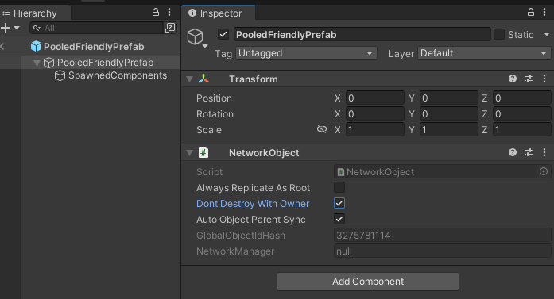
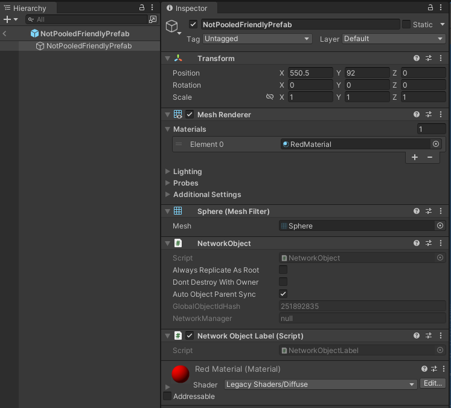
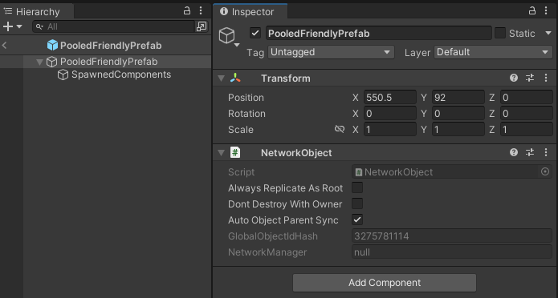
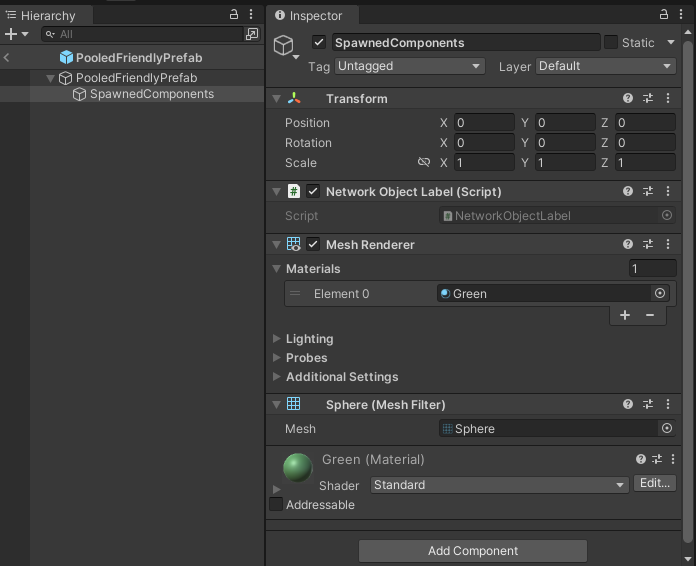

# Object spawning

Instantiate networked objects and synchronize them across all clients in a session.

In Unity, you typically create a new GameObject using the `Instantiate` method, which only creates that object on the local machine. Spawning in Netcode for GameObjects means that you instantiate an object and Netcode for GameObjects synchronizes it across all clients.

## Network prefabs

A network prefab is any Unity prefab asset that has one `NetworkObject` component attached to a GameObject within the prefab. More commonly, the `NetworkObject` component is attached to the root GameObject of the prefab asset, because this allows any child GameObject to have `NetworkBehaviour` components automatically assigned to the `NetworkObject`. Netcode for GameObjects associates a `NetworkObject` component with any `NetworkBehaviour` components on:

- The same GameObject that the `NetworkObject` component is attached to.
- Any child GameObject of the GameObject that the `NetworkObject` is attached to.

> [!NOTE]
> A caveat of these two rules is when one of the child GameObjects also has a `NetworkObject` component assigned to it, also known as nested NetworkObjects. Because nested `NetworkObject` components aren't permitted in network prefabs, Netcode for GameObjects notifies you in the Editor if you try to add more than one `NetworkObject` to a prefab, and doesn't allow it.

When a `NetworkBehaviour` is assigned to a `NetworkObject`, Netcode for GameObjects uses the `NetworkObject.NetworkObjectId` to determine which `NetworkBehaviour` component instance receives an update to a `NetworkVariable`, or where to invoke an RPC. A `NetworkObject` component can have one or more `NetworkBehaviour` components assigned to it.

### Register a network prefab

You must register a network prefab instance with a `NetworkManager` using a `NetworkPrefabsList` scriptable object.

To register a network prefab with a `NetworkManager`, follow these steps:

1. Create a prefab, then attach a `NetworkObject` component to its root GameObject.
1. In the **Project** window, right-click and select **Create** > **Netcode** > **Network Prefabs List**.
1. Add your network prefab to the `NetworkPrefabsList`.
1. In the **NetworkManager** component, add the `NetworkPrefabsList` to the **Network Prefabs Lists** property.

The network prefab is now registered, and you can spawn it at runtime.

## Spawn a network prefab

When you use a [server-authoritative networking model](../terms-concepts/authority.md#server-authority), only the server or host can spawn NetworkObjects. Under a [distributed authority networking model](../terms-concepts/authority.md#distributed-authority), any client can spawn NetworkObjects. The client that spawns the NetworkObject becomes the [authority](../terms-concepts/authority.md) of that object.

To spawn a network prefab, first create an instance of the network prefab, then invoke the spawn method on the `NetworkObject` component of the instance you created. In most cases, keep the `NetworkObject` component attached to the root GameObject of the network prefab.

For more information, refer to [NetworkObject ownership](../components/core/networkobject-ownership.md).

The following is a basic example of how to spawn a network prefab instance:

```csharp
var instance = Instantiate(myPrefab);
var instanceNetworkObject = instance.GetComponent<NetworkObject>();
instanceNetworkObject.Spawn();
```

The `NetworkObject.Spawn` method takes one optional parameter that defaults to `false`:

```csharp
public void Spawn(bool destroyWithScene = false);
```

When `destroyWithScene` is `false`, the spawned instance behaves the same as an object you pass to [`Object.DontDestroyOnLoad`](https://docs.unity3d.com/ScriptReference/Object.DontDestroyOnLoad.html): unloading its scene doesn't destroy it. This is usually the behavior you want when you load scenes with the [`LoadSceneMode.Single`](https://docs.unity3d.com/ScriptReference/SceneManagement.LoadSceneMode.html) parameter. Set it to `true` if you instead want Unity to destroy the instance with its scene.

For more information, refer to [Scene management overview](scenemanagement/scene-management-overview.md).

> [!NOTE]
> You might find it useful to add a GameObject property in a `NetworkBehaviour`-derived component to use when you assign a network prefab instance for dynamic spawning. Make sure you instantiate a new instance before you spawn it. If you spawn the network prefab asset itself, you get unexpected results.

## Consider prefab overrides

Sometimes, you might want to use a different prefab instance on the authority compared to other clients. Take this into account when you dynamically spawn a network prefab. If you run as a host, you want the override to spawn, because a host is both a server and a client. However, if you also want the ability to run as a dedicated server, you might want to spawn the source network prefab.

You can do this in two ways.

### Get the network prefab override first

This option provides you with the overall view of getting the network prefab override, instantiating it, and then spawning it.

```csharp
var instance = Instantiate(NetworkManager.GetNetworkPrefabOverride(myPrefab));
var instanceNetworkObject = instance.GetComponent<NetworkObject>();
instanceNetworkObject.Spawn();
```

The preceding script gets the prefab override with the `NetworkManager.GetNetworkPrefabOverride` method, creates an instance of the network prefab override, and then spawns that instance's `NetworkObject`.

### Instantiate and spawn in one call

The second option is to use the `NetworkSpawnManager.InstantiateAndSpawn` method, which handles whether to spawn an override for you. The following example assumes that you invoke it inside a `NetworkBehaviour`.

```csharp
// SpawnManager.InstantiateAndSpawn takes the NetworkObject of the source prefab
var networkObject = NetworkManager.SpawnManager.InstantiateAndSpawn(myPrefab.GetComponent<NetworkObject>(), ownerId);
```

Pass in the source network prefab to instantiate and spawn. The method returns the `NetworkObject` of the spawned instance. By default, `InstantiateAndSpawn` spawns the original source prefab if you run as a server, and the override otherwise.

`InstantiateAndSpawn` has several parameters to provide more control over this process:

```csharp
InstantiateAndSpawn(NetworkObject networkPrefab, ulong ownerClientId = NetworkManager.ServerClientId, bool destroyWithScene = false, bool isPlayerObject = false, bool forceOverride = false, Vector3 position = default, Quaternion rotation = default)
```

> [!NOTE]
> The first parameter is a `NetworkObject`, not a `GameObject`. If you only hold a reference to the prefab's `GameObject`, either get its `NetworkObject` component as shown in the previous example, or use the static `NetworkObject.InstantiateAndSpawn(GameObject networkPrefab, NetworkManager networkManager, ...)` overload, which accepts the `GameObject` directly.

By default, these parameters set the server as the owner, keep the instantiated `NetworkObject` when Unity unloads the scene, don't spawn the object as a player object, don't force the prefab override, and set the position and rotation of the newly instantiated `NetworkObject`.

If you set `forceOverride` to `true`, Netcode for GameObjects always uses the override.

To override prefabs on non-authority clients, refer to [Network prefab handler](../advanced-topics/network-prefab-handler.md).

## Destroy and despawn objects

By default, when you destroy a spawned network prefab instance on the authority, Netcode for GameObjects automatically destroys it on all clients.

When a client disconnects, by default it destroys all network prefab instances that it dynamically created during the network session. If you don't want that to happen, set the `DontDestroyWithOwner` field on `NetworkObject` to `true` before you despawn.

To do this at runtime:

```csharp
m_SpawnedNetworkObject.DontDestroyWithOwner = true;
m_SpawnedNetworkObject.Despawn();
```

To make this the default in the **Inspector** window:



As an alternative, you can make the `NetworkObject.DontDestroyWithOwner` property default to `true` by setting it on the `NetworkObject` itself, as shown in the previous screenshot.

### Despawn an object

Only the authority can despawn a `NetworkObject`, and the default despawn behavior is to destroy the associated GameObject. To despawn but not destroy a `NetworkObject`, call `NetworkObject.Despawn` and pass `false` as the parameter. Netcode for GameObjects always notifies non-authority clients, which mirror the despawn behavior. If you despawn and destroy on the authority, all other connected clients despawn and then destroy the GameObject that the `NetworkObject` component is attached to.

On the non-authority side, never call `Object.Destroy` on any GameObject with a `NetworkObject` component attached to it. Netcode for GameObjects doesn't support this and throws an exception. To allow non-authority clients to destroy objects they don't own, have the relevant client invoke an RPC to defer the despawning on the authority side.

The only way to despawn a `NetworkObject` for a specific client is to use `NetworkObject.NetworkHide`. For more information, refer to [Object visibility](object-visibility.md).

> [!NOTE]
> If you have child GameObjects with `NetworkBehaviour` components attached, of a parent GameObject with a `NetworkObject` component attached, you can't disable the child GameObjects before you spawn or despawn. Make sure all child GameObjects are enabled in the hierarchy before you spawn or despawn.

## Spawn network prefabs dynamically

Netcode for GameObjects uses the term dynamically spawned to convey that your own code spawns the `NetworkObject`, whereas Netcode for GameObjects typically spawns a player or in-scene placed `NetworkObject` when scene management is enabled. There are several ways to spawn a network prefab in code:

### Spawn dynamically without pooling

This type of dynamically spawned `NetworkObject` is typically a simple wrapper class that holds a reference to the prefab asset. In the following example, the `NonPooledDynamicSpawner.PrefabToSpawn` property holds a reference to the network prefab:

```csharp
using Unity.Netcode;
using UnityEngine;

public class NonPooledDynamicSpawner : NetworkBehaviour
{
    public GameObject PrefabToSpawn;
    public bool DestroyWithSpawner;
    private GameObject m_PrefabInstance;
    private NetworkObject m_SpawnedNetworkObject;

    public override void OnNetworkSpawn()
    {
        // Only the authority spawns, other clients will disable this component on their side
        enabled = HasAuthority;
        if (!enabled || PrefabToSpawn == null)
        {
            return;
        }
        // Instantiate the GameObject Instance
        m_PrefabInstance = Instantiate(PrefabToSpawn);

        // Optional, this example applies the spawner's position and rotation to the new instance
        m_PrefabInstance.transform.SetPositionAndRotation(transform.position, transform.rotation);

        // Get the instance's NetworkObject and Spawn
        m_SpawnedNetworkObject = m_PrefabInstance.GetComponent<NetworkObject>();
        m_SpawnedNetworkObject.Spawn();
    }

    public override void OnNetworkDespawn()
    {
        if (HasAuthority && DestroyWithSpawner && m_SpawnedNetworkObject != null && m_SpawnedNetworkObject.IsSpawned)
        {
            m_SpawnedNetworkObject.Despawn();
        }
        base.OnNetworkDespawn();
    }
}
```

Consumables and items that a player or non-player character (NPC) can pick up, such as a weapon, health, or a potion, are examples of when to use non-pooled dynamically spawned `NetworkObject` instances.

> [!NOTE]
> The `NonPooledDynamicSpawner` example is one way to spawn a `NetworkObject`, but there's a memory allocation cost associated with instantiating and destroying the GameObject and all attached components. This design pattern can sometimes be all you need for the netcode asset you're working with, and other times you might want to respawn or reuse the object instance. When performance is a concern and you want to spawn more than one `NetworkObject` during the lifetime of the spawner, or want to repeatedly respawn a single `NetworkObject`, the less processor-intensive and memory-intensive technique is to [spawn dynamically with pooling](#spawn-dynamically-with-pooling).

> [!NOTE]
> Generally, the term non-pooled means that Netcode for GameObjects instantiates a GameObject on all clients each time you spawn an instance.

### Spawn dynamically with pooling

Pooled dynamic spawning is when clients don't destroy netcode objects (a GameObject with one `NetworkObject` component) when you despawn them. Instead, Netcode for GameObjects disables specific components, or the GameObject itself, when you despawn a netcode object. You typically instantiate a pooled dynamically spawned netcode object during a memory-allocation-heavy period, such as when Unity loads a scene, or at the start of your application before you establish a network connection. Pooled dynamically spawned netcode objects are usually multiple objects that you can reuse without incurring the memory allocation and initialization costs. However, you might also encounter scenarios where you need one dynamically spawned netcode object to behave like a pooled dynamically spawned netcode object.

Netcode for GameObjects lets you control the instantiation and destruction process for one or many netcode objects via the `INetworkPrefabInstanceHandler` interface. To do this, register your `INetworkPrefabInstanceHandler` implementation with the `NetworkPrefabHandler`. For multiple netcode objects, refer to [Object pooling](../advanced-topics/object-pooling.md).

One way to avoid destroying a network prefab instance is to have something other than the instance itself keep a reference to it. This way, you can set the root GameObject to inactive when you despawn it, and set it active again when you respawn the same network prefab type. The following example shows how to do this for a single netcode object instance:

```csharp
using System.Collections;
using Unity.Netcode;
using UnityEngine;

public class SinglePooledDynamicSpawner : NetworkBehaviour, INetworkPrefabInstanceHandler
{
    public GameObject PrefabToSpawn;
    public bool SpawnPrefabAutomatically;

    private GameObject m_PrefabInstance;
    private NetworkObject m_SpawnedNetworkObject;

    private void Start()
    {
        // Instantiate our instance when we start (for all connected game clients)
        m_PrefabInstance = Instantiate(PrefabToSpawn);

        // Get the NetworkObject component assigned to the prefab instance
        m_SpawnedNetworkObject = m_PrefabInstance.GetComponent<NetworkObject>();

        // Set it to be inactive
        m_PrefabInstance.SetActive(false);
    }

    private IEnumerator DespawnTimer()
    {
        yield return new WaitForSeconds(2);
        m_SpawnedNetworkObject.Despawn();
        StartCoroutine(SpawnTimer());
        yield break;
    }

    private IEnumerator SpawnTimer()
    {
        yield return new WaitForSeconds(2);
        SpawnInstance();
        yield break;
    }

    /// <summary>
    /// Invoked only on non-authority clients
    /// INetworkPrefabInstanceHandler.Instantiate implementation
    /// Called when Netcode for GameObjects needs an instance to be spawned
    /// </summary>
    public NetworkObject Instantiate(ulong ownerClientId, Vector3 position, Quaternion rotation)
    {
        m_PrefabInstance.SetActive(true);

        // Use the position and rotation passed in by Netcode for GameObjects so that
        // this instance matches the one on the authority
        m_PrefabInstance.transform.SetPositionAndRotation(position, rotation);
        return m_SpawnedNetworkObject;
    }

    /// <summary>
    /// Called on all game clients
    /// INetworkPrefabInstanceHandler.Destroy implementation
    /// </summary>
    public void Destroy(NetworkObject networkObject)
    {
        m_PrefabInstance.SetActive(false);
    }

    public void SpawnInstance()
    {
        if (!HasAuthority)
        {
            return;
        }

        if (m_PrefabInstance != null && m_SpawnedNetworkObject != null && !m_SpawnedNetworkObject.IsSpawned)
        {
            m_PrefabInstance.SetActive(true);
            m_SpawnedNetworkObject.Spawn();
            StartCoroutine(DespawnTimer());
        }
    }

    public override void OnNetworkSpawn()
    {
        // We register our network prefab and this NetworkBehaviour that implements the
        // INetworkPrefabInstanceHandler interface with the prefab handler
        NetworkManager.PrefabHandler.AddHandler(PrefabToSpawn, this);

        if (!HasAuthority || !SpawnPrefabAutomatically)
        {
            return;
        }

        SpawnInstance();
    }

    public override void OnNetworkDespawn()
    {
        if (m_SpawnedNetworkObject != null && m_SpawnedNetworkObject.IsSpawned)
        {
            m_SpawnedNetworkObject.Despawn();
        }
        base.OnNetworkDespawn();
    }

    public override void OnDestroy()
    {
        if (m_PrefabInstance != null)
        {
            // Always deregister the prefab. The NetworkManager can already be destroyed
            // during teardown, so check it before using it to avoid a null reference.
            if (NetworkManager != null)
            {
                NetworkManager.PrefabHandler.RemoveHandler(PrefabToSpawn);
            }
            Destroy(m_PrefabInstance);
        }
        base.OnDestroy();
    }
}
```

You might encounter a situation where you still want other components on the root GameObject of your network prefab instance to remain active. Primarily, you need to disable the components that are normally active when the netcode object is spawned.

The following image shows a prefab that's not pooling-friendly:



The issue with the previous prefab hierarchy is that everything is on a single GameObject. If you want to disable the `MeshRenderer` and the `NetworkObjectLabel`, a class in the Netcode for GameObjects test project (refer to [`NetworkObjectLabel`](https://github.com/Unity-Technologies/com.unity.netcode.gameobjects/blob/f0631414e5a5358a5ac7811d43273b1a82a60ca9/testproject/Assets/Scripts/NetworkObjectLabel.cs#L4) on GitHub), you need to get those component types before you disable them, for example during `Start` or `OnNetworkSpawn`, or when Netcode for GameObjects invokes `OnNetworkDespawn`.

To reduce this level of complexity, a more pooling-friendly prefab hierarchy might look like this:



The `NetworkObject` sits at the root GameObject of the network prefab. The child GameObject, `SpawnedComponents`, contains everything you might want to disable when the network prefab instance isn't spawned:



This reduces the complexity to setting the `SpawnedComponents` GameObject to inactive, which also disables all the components attached to it.

> [!NOTE]
> This type of hierarchical separation is useful in many ways, especially when you have a much more complex prefab. For more complex prefabs, you can expand this pattern into specific categories, for example visuals, physics, and sound, which gives you a broader way to control enabling or disabling many different components without having to hold references to all of them.

## Use in-scene placed NetworkObjects

Netcode for GameObjects automatically replicates any objects in the scene that have active and spawned `NetworkObject` components. There's no need to manually spawn them when scene management is enabled in the `NetworkManager`. Typically, use in-scene placed `NetworkObject` instances as static netcode objects: the authority spawns them when it loads the scene, and other clients synchronize them after they finish loading the same scene.

For more information, refer to [In-scene placed NetworkObjects](scenemanagement/inscene-placed-networkobjects.md).

Two modes define how Netcode for GameObjects synchronizes an in-scene placed `NetworkObject`:

- Soft synchronization (scene management enabled)
- Prefab synchronization (scene management disabled)

### Soft synchronization

`SoftSync`, or soft synchronization, is a term you might encounter if you have an issue with in-scene placed `NetworkObject` instances. Soft synchronization only occurs if scene management is enabled in the `NetworkManager` properties. If you receive a soft synchronization error, this typically means that a client can't locate the same in-scene placed `NetworkObject` after it loads a scene.

### Prefab synchronization

Netcode for GameObjects uses `PrefabSync`, or prefab synchronization, if scene management is disabled in the `NetworkManager`. With prefab synchronization, you must make every in-scene placed `NetworkObject` a network prefab and register it in the `NetworkPrefabs` list. When a client starts, Netcode for GameObjects destroys all existing in-scene placed `NetworkObject` instances and spawns their corresponding prefabs from the `NetworkPrefabs` list instead. This also means you must implement your own scene manager and handle how you synchronize clients when they join a network session.

Only use `PrefabSync` for advanced development or multiproject setups, because it requires you to manage scene synchronization yourself.

## Additional resources

- [NetworkObject ownership](../components/core/networkobject-ownership.md)
- [Authority](../terms-concepts/authority.md)
- [Scene management overview](scenemanagement/scene-management-overview.md)
- [In-scene placed NetworkObjects](scenemanagement/inscene-placed-networkobjects.md)
- [Network prefab handler](../advanced-topics/network-prefab-handler.md)
- [Object pooling](../advanced-topics/object-pooling.md)
- [Object visibility](object-visibility.md)
