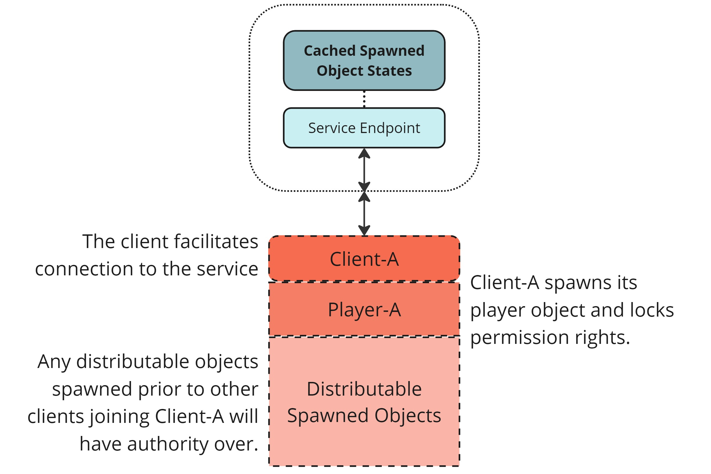
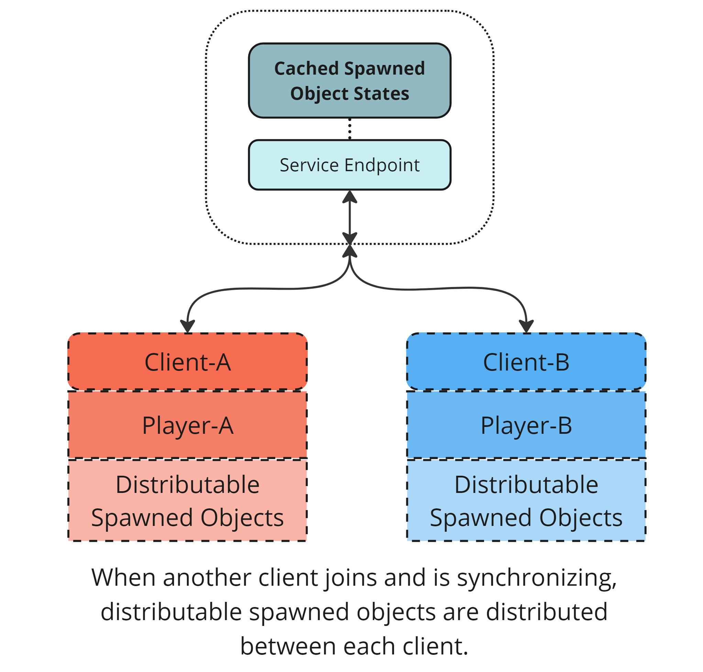

# Understanding ownership and authority

By default, Netcode for GameObjects assumes a [client-server topology](../terms-concepts/client-server.md), in which the server owns all NetworkObjects (with [some exceptions](../components/core/networkobject.md#ownership)) and has ultimate authority over [spawning and despawning](object-spawning.md).

Netcode for GameObjects also supports building games with a [distributed authority topology](../terms-concepts/distributed-authority.md), which provides more options for ownership and authority over NetworkObjects.

## Ownership and distributed authority

In a distributed authority setting, authority over NetworkObjects isn't bound to a single server, but distributed across clients depending on a NetworkObject's [ownership permission settings](#ownership-permission-settings-distributed-authority-only). NetworkObjects with the distributable permission set are automatically distributed amongst clients as they connect and disconnect.

When a client starts a distributed authority session it spawns its player, locks the local player's permissions so that no other client can take ownership, and then spawns some NetworkObjects. At this point, Client-A has full authority over the distributable spawned objects and its player object.

When another player joins, as in the diagram below, authority over distributable objects is split between both clients. Distributing the NetworkObjects in this way reduces the overall processing and bandwidth load for both clients. The same distribution happens when a player leaves, either gracefully or unexpectedly. The ownership and last known state of the subset of objects owned by the leaving player is transferred over to the remaining connected clients with no interruption in gameplay.

### Ownership permission settings (distributed authority only)

The following ownership permission settings, defined by `NetworkObject.OwnershipStatus`, only take effect when using a distributed authority network topology:

* `None`: Ownership of this NetworkObject is considered static and can't be redistributed, requested, or transferred (a Player would have this, for example).
* `Distributable`: Ownership of this NetworkObject is automatically redistributed when a client joins or leaves, as long as ownership is not locked or a request is pending.
* `Transferable`: Ownership of this NetworkObject can be transferred immediately, as long as ownership is not locked and there are no pending requests.
* `RequestRequired`: Ownership of this NetworkObject must be requested before it can be transferred and will always be locked after transfer.
* `SessionOwner`: This NetworkObject is always owned by the [session owner](../terms-concepts/distributed-authority.md#session-ownership) and can't be transferred or distributed. If the session owner changes, this NetworkObject is automatically transferred to the new session owner.

You can also use `NetworkObject.SetOwnershipLock` to lock and unlock the permission settings of a NetworkObject for a period of time, preventing ownership changes on a temporary basis.

> [!NOTE]
> The ownership permissions are only visible when the Multiplayer Services SDK package is installed and you're inspecting a NetworkObject within the editor. Ownership permissions have no impact when using a client-server network topology, since the server always has authority. For ownership permissions to be used, you must be using a distributed authority network topology.
