# AttachableBehaviour
The `AttachableBehaviour` Provides "out of the box" support for attaching (i.e. parenting) a nested child `GameObject` that includes an `AttachableBehaviour` component to another nested child `GameObject` with an `AttachableNode` component that is associated with a different `NetworkObject`.

## Attaching vs NetworkObject parenting

Fundamentally, attaching is another way to synchronize parenting while not requiring one to use the traditional `NetworkObject` parenting. Attaching a child `GameObject` nested under a `NeworkObject` (_really the `GameObject` the `NetworkObject` component belongs to_) will only take the child `GameObject` and parent it under the `GameObject` of an `AttachableNode`. The target to parent under must be of a different spawned `NetworkObject` and the `AttachableNode` needs to be on the same or child `GameObject` of the target `NetworkObject`.

### NetworkObject parenting

The traditional approach has been to spawn two network prefab instances:<br />
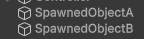

Then parent one instance under the other:<br />
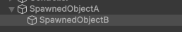

This is simple enough for many scenarios, but can become cumbersome under more specific scenarios where a user might want to have a "world" version of the item and a "picked up" version of the item.

### Attaching

With attaching, a user would create nested `GameObject` children that represent the item when it is picked up and when it is dropped/placed somewhere in the scene (i.e. world).<br />
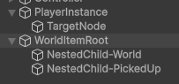

 - The WorldItemRoot is where the `NetworkObject` component is placed.
 - The NestedChild-World contains the components needed for the item when it is placed in the world.
 - The NestedChild-PickedUp contains the components needed for the item when it is picked up by a player.

By placing an `AttachableBehaviour` component on the NestedChild-PickedUp `GameObject` and an `AttachableNode` component on the TargetNode, a user can then invoke the `AttachableBehaviour.Attach` method while passing in the `AttachableNode` component and the NestedChild-PickedUp `GameObject` will get parented under the TargetNode while also synchronizing this action with all other clients.<br />
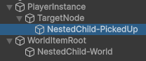

### AttachableBehaviour 

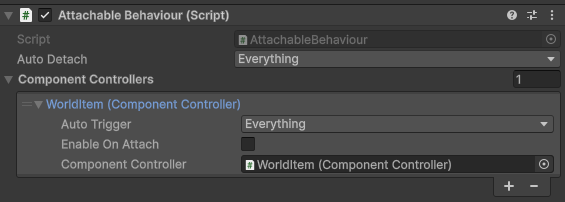

The basic functionality of the `AttachableBehaviour` component provides:
- The ability to assign (make aware) `ComponetController` components from any part of the parent-child hierarchy.
  -  Each `ComponentControllerEntry` provides the ability to select when the `ComponentController` should be triggered (via the **Auto Trigger** property) and whether its enabled state should be enabled or disabled  upon attaching (via the **Enable On Attach** property). The default setting is to be disabled upon the `AttachableBehaviour` attaching to an `AttachableNode` and enabled upon detaching.  When the **Enable On Attach** property is enabled, the `ComponentController` will be set to enabled upon the `AttachableBehaviour` attaching to an `AttachableNode` and disabled upon detaching.
- The ability to control when an `AttachableBehaviour` component will automatically detach from an `AttachableNode` via the **Auto Detach** property.
  - The **Auto Detach** property can have any combination of the below flags or none (no flags):
    - **On Ownership Changed:** Upon ownership changing, the `AttachableBehaviour` will detach from any `AttachableNode` it is attached to.
    - **On Despawn:**  Upon the `AttachableBehaviour` being despawned, it will detach from any `AttachableNode` it is attached to.
    - **On Attach Node Destroy**: Just prior to the `AttachableNode` being destroyed,  any  attached `AttachableBehaviour` with this flag will automatically detach from the `AttachableNode`.

_Any of the `AttachableBehaviour.AutoDetach` settings will be invoked on all instances without the need for the owner to synchronize the end result(i.e. detaching) which provides a level of redundancy for edge case scenarios like a player being disconnected abruptly by the host or by timing out or any scenario where a spawned object is being destroyed with the owner or perhaps being redistributed to another client authority in a distributed authority session. Having the ability to select or deselect any of the auto-detach flags coupled with the ability to derive from `AttachableBehaviour` provides additional levels of modularity/customization._

### AttachableNode

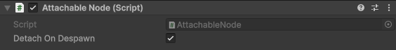

The simplest component in the bunch, this provides a valid connection point (_i.e. what an `AttachableBehaviour` can attach to_) with the ability to have it automatically detach from any attached `AttachableBehaviour` instances when it is despawned.

### ComponentController

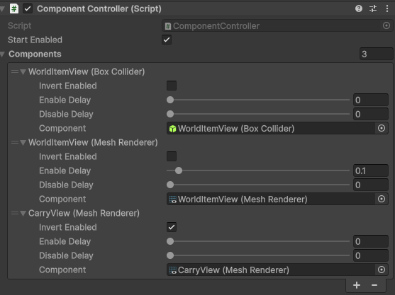

Taking the above example into consideration, it would make sense that a user would want to be able to easily control whether a specific component is enabled or disabled when something is attached or detached. 

As an example:

- When the WorldItemRoot is in the "placed in the world" state, it would make sense to disable any `MeshRenderer`, `Collider`, and other components on the NestedChild-PickedUp `GameObject` while enabling similar types of components on the NestedChild-World.
- When the WorldItemRoot is in the "picked up" state, it would make sense to enable any `MeshRenderer`, `Collider`, and other components on the NestedChild-PickedUp `GameObject` while disabling similar types of components on the NestedChild-World.
- It would also make sense to synchronize the enabling or disabling of components with all instances.

The `ComponentController` provides this type of functionality:
- Can be used with `AttachableBehaviour` or independently for another purpose.
- Each assigned component entry can be configured to directly or inversely follow the `ComponentController`'s current state.
- Each assigned component entry can have an enable and/or disable delay.
  -  _When invoked internally by `AttachableBehaviour`, delays are ignored when an `AttachableNode` is being destroyed and the changes are immediate._

The `ComponentController` could be daisy chained with minimal user script:
```csharp
/// <summary>
/// Use as a component in the ComponentController that will
/// trigger the Controller (ComponentController).
/// This pattern can repeat.
/// </summary>
public class DaisyChainedController : MonoBehaviour
{
    public ComponentController Controller;

    private void OnEnable()
    {
        if (!Controller || !Controller.HasAuthority)
        {
            return;
        }
        Controller.SetEnabled(true);
    }

    private void OnDisable()
    {
        if (!Controller || !Controller.HasAuthority)
        {
            return;
        }
        Controller.SetEnabled(false);
    }
}
```

### Example of synchronized RPC driven properties

Both the `AttachableBehaviour` and the `ComponentController` provide an example of using synchronized RPC driven properties in place of `NetworkVariable`. Under certain conditions it is better to use RPCs when a specific order of operations is needed as opposed to `NetworkVariable`s which can update out of order (regarding the order in which certain states were updated) depending upon several edge case scenarios.

Under this condition using reliable RPCs will assure the messages are received in the order they were generated while also reducing the latency time between the change and the non-authority instances being notified of the change. Synchronized RPC driven properties only require overriding the `NetworkBehaviour.OnSynchronize` method and serializing any properties that need to be synchronized with late joining players or handling network object visibility related scenarios.

## Usage Walk Through

### Introduction

For example purposes, we will walk through a common scenario where you might want to have a world item that had unique visual and scripted components active while while placed in the world but then can switch to a different set of visual and scripted components when picked up by a player's avatar. Additionally, you might want to be able to easily "attach" only the portion of the item, that is active when picked up, to one of the player's avatar's child nodes. Below is a high-level diagram overview of what both the player and world item network prefabs could look like:<br />

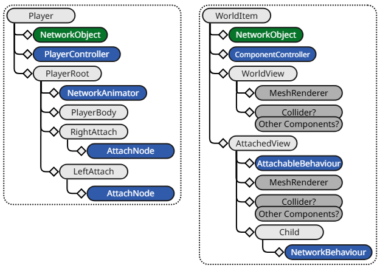

#### Player 

The player prefab in the above diagram is not complete, includes the components of interest, and some additional children and components for example purposes. A complete diagram would most definitely have additional components and children. The `AttachableNode` components provide a "target attach point" that any other spawned network prefab with an `AttachableBehaviour` could attach itself to.

#### World Item

This diagram has a bit more detail to it and introduces one possible usage of a `ComponentController` and `AttachableBehaviour`. The `ComponentController` will be used to control the enabling and disabling of components and synchronizing this with non-authority instances. The `AttachableBehaviour` resides on the child `AttachedView`'s `GameObject` and will be the catalyst for attaching to a player.

### World vs Attached View Modes

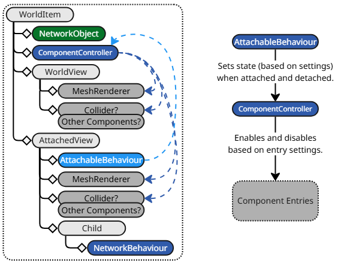


In the diagram above, we see arrows pointing from the `ComponentController` to the non-netcode standard Unity components such as a `MeshRenderer`, `Collider`, or any other component that should only be enabled when either in "World View" or "Attached View" modes. We can also see that the `AttachableBehaviour` points to the `ComponentController` with a diagram to the right that shows the `AttachableBehaviour` notifies the `ComponentController` that, in turn, enables or disables certain components.

#### World Item Component Controller
Below is a screenshot of what the `ComponentController` would look like in the inspector view:<br />


Looking at the `ComponentController`'s **Components** property, we can see two of the component entries have references to the `WorldItemView`'s `BoxCollider` and `MeshRenderer` that are both configured to be enabled when the `ComponentController`'s state is `true`. We can also see that the `CarryView`'s `MeshRenderer` is added and configured to be the inverse of the current `ComponentController`'s state. Since the `ComponentController`'s **Start Enabled** property is enabled we can logically deduce the **WorldItem** network prefab will start with the `WorldItemView` being active when spawned. Taking a look at the **CarryObject** child's properties:

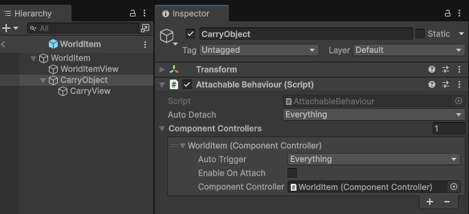

We can see the `AttachableBehaviour`'s **Component Controllers** list contains `ComponentControllerEntry` (WorldItem Component Controller) that references to the `WorldItem`'s `ComponentController`. We can also see that the `ComponentControllerEntry` is configured to trigger on everything (_OnAttach and OnDetach_) and will set the `ComponentController`'s state to disabled _(false)_. This means when the `AttachableBehaviour` is attached the `ComponentController` will be in the disabled state along with the `WorldItemView` components while the `CarryView`'s `MeshRenderer` will be enabled.

**Summarized Overview:**
- `AttachableBehaviour` sets the `ComponentController` state (true/enabled or false/disabled).
-  `ComponentController` states:
    - Enabled (true)
        - World Item View (enabled/true)
        - Carry View (disabled/false)
    - Disabled (false)
        - World Item View (disabled/false)
        - Carry View (enabled/true)

### Attaching

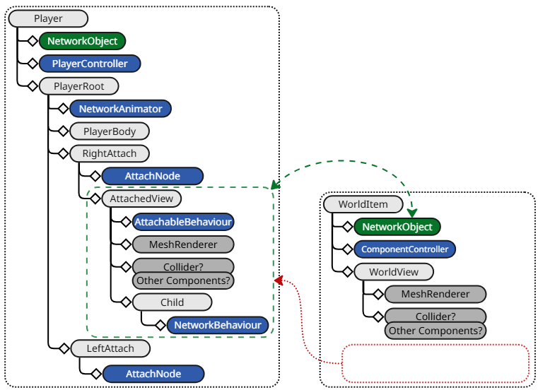

The above diagram represents what the **Player** and **World Item** spawned objects (_including cloned/non-authority instances_) would look like once the **Attached View** object has been parented under the avatar's **Right Attach** object. The green area and arrow represent the still existing relationship that the **Attached View** has with the **World Item**'s `NetworkObject`. 

:::info
**AttachableBehaviour & NetworkObject Relationship**

Upon a `NetworkObject` component being spawned, all associated `NetworkBehaviour` based component instances, that are directly attached to the `NetworkObject`'s `GameObject` or are on any child `GameObject`, will be registered with the `NetworkObject` instance. This remains true even when a child `GameObject` containing one or more `NetworkBehaviour` based component instances of a spawned `NetworkObject` is parented, during runtime, under another `GameObject` that is associated with a different spawned `NetworkObject`. Of course, there are additional considerations like:
 - What happens when one or both of the NetworkObjects is de-spawned?
 - How do you assure the child attachable will return back to its default parent? 
 - and several other edge case scenarios...

`AttachableBehaviour` leverages from this "spawn lifetime" relationship to provide another type of "parenting" (attaching) while also taking into consideration these types of edge case scenarios.
:::

