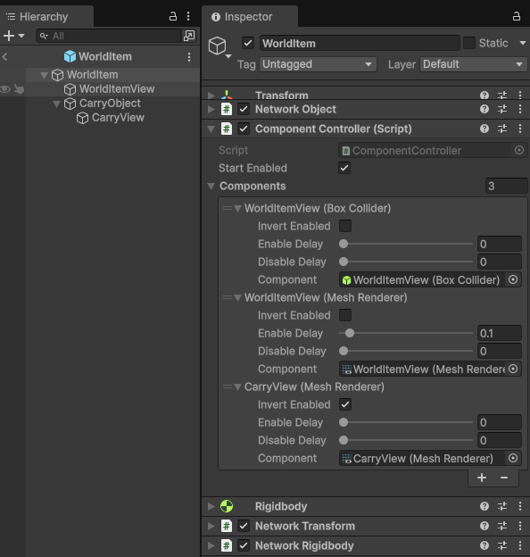

# ComponentController

A `ComponentController` provides you with the ability to enable or disable one or more components by the authority instance and have those changes synchronized with non-authority/remote instances. It uses a [synchronized RPC driven field approach](../foundational/networkbehaviour-synchronize.md#synchronized-rpc-driven-fields) to synchronize its enabled state of the components it is controlling to assure optimal performance and that the order of operations of changes is relative to other `ComponentController` and/or other `AttachableBehaviour` component instances.

The `ComponentController` can be:
- Used with `AttachableBehaviour` or independently for another purpose.
- Configured to directly or inversely follow the `ComponentController`'s current state.
- Configured to have an enable and/or disable delay.
  - _When invoked internally by `AttachableBehaviour`, delays are ignored when an `AttachableNode` is being destroyed and the changes are immediate._

## Configuring



A `ComponentController` can have one or more `ComponentEntry` entries in its **Components** list. Each `ComponentEntry` has some additional fields that you can adjust based on your desired result:
- **Invert Enabled:** When enabled, this will make the associated component inversely follow the `ComponentControllers` global enabled state. This is useful if you want a set of components to be enabled when the `ComponentController` component's global enable state is set to `false` and for that same set of components to be disabled when the `ComponentController` component's global enable state is set to `true`.
- **Enable Delay:** When greater than 0 (the default), the component will delay transitioning from a disabled state to an enabled state by the amount of time (in seconds) specified.
- **Disable Delay:** When greater than 0 (the default), the component will delay transitioning from an enabled state to a disabled state by the amount of time (in seconds) specified.
- **Component:** The component to control and synchronize its enabled state.

Both delay values (Enable & Disable) has many uses, but an example would be to prevent a `MeshRenderer` from being enabled prior to other specific events like avoiding it from rendering for a few frames while the attachable is positioned.

## Examples

### Independent Usage

While `ComponentController` can be used with an `AttachableBehaviour` without writing any script, you might find that it can be used for many other purposes. Below is a pseudo example where a `ComponentController` would have its synchronized enabled state updated when the `DaisyChainedController` is either enabled or disabled.

```csharp
/// <summary>
/// Use as a component in the ComponentController that will
/// trigger the Controller (ComponentController).
/// This pattern can repeat/be daisy chained.
/// </summary>
public class DaisyChainedController : MonoBehaviour
{
    public ComponentController Controller;

    private void OnEnable()
    {
        if (!Controller || !Controller.HasAuthority)
        {
            return;
        }
        Controller.SetEnabled(true);
    }

    private void OnDisable()
    {
        if (!Controller || !Controller.HasAuthority)
        {
            return;
        }
        Controller.SetEnabled(false);
    }
}
```
The above component could be arranged to create a chained sequence of components when the root `DaisyChainedController` component is enabled or disabled. Such a sequence could look like:

- DaisyChainedController-A
  - Controller
    - Points to DaisyChainedController-B
- DaisyChainedController-B
  - Controller
    - Points to DaisyChainedController-C
- DaisyChainedController-C
  - Controller

When DaisyChainedController-A is enabled, then a sequence of events would occur where DaisyChainedController-B and DaisyChainedController-C would be enabled. The same sequence of events would occur when DaisyChainedController-A was then disabled.

### AttachableBehaviour Usage

The `AttachableBehaviour` can be assigned one or more component controllers that will be invoked, depending upon configuration, when the `AttachableBehaviour` is attached and detached from an `AttachableNode`. You can find the [usage example with an `AttachableBehaviour` here.](attachablebehaviour.md#usage-walk-through) 

:::info
**Example of synchronized RPC driven properties**

Both the `AttachableBehaviour` and the `ComponentController` provide an example of using synchronized RPC driven properties in place of `NetworkVariable`. Under certain conditions it is better to use RPCs when a specific order of operations is needed as opposed to `NetworkVariable`s which can update out of order (regarding the order in which certain states were updated) depending upon several edge case scenarios.

Under this condition using reliable RPCs will assure the messages are received in the order they were generated while also reducing the latency time between the change and the non-authority instances being notified of the change. Synchronized RPC driven properties only require overriding the `NetworkBehaviour.OnSynchronize` method and serializing any properties that need to be synchronized with late joining players or handling network object visibility related scenarios.
:::

## Additional resources

- [AttachableBehaviour](attachablebehaviour.md)
- [AttachableNode](attachablenode.md)