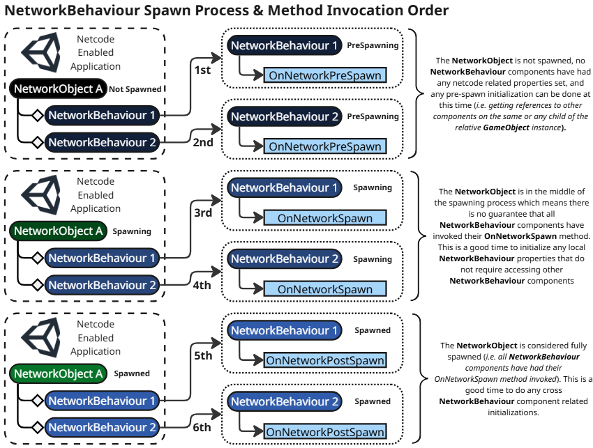
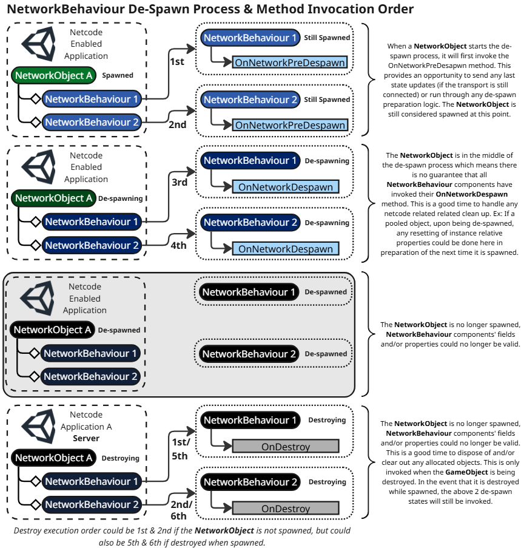

# NetworkBehaviour spawning and despawning

[NetworkBehaviour](https://docs.unity3d.com/Packages/com.unity.netcode.gameobjects@latest?subfolder=/api/Unity.Netcode.NetworkBehaviour.html) is an abstract class that derives from [MonoBehaviour](https://docs.unity3d.com/ScriptReference/MonoBehaviour.html) and is primarily used to create unique netcode or game logic. To replicate any netcode-aware properties or send and receive RPCs, a [GameObject](https://docs.unity3d.com/Manual/GameObjects.html) must have a [NetworkObject](networkobject.md) component and at least one NetworkBehaviour component.

A NetworkBehaviour requires a NetworkObject component on the same relative GameObject or on a parent of the GameObject with the NetworkBehaviour component assigned to it. If you add a NetworkBehaviour to a GameObject that doesn't have a NetworkObject (or any parent), then Netcode for GameObjects automatically adds a NetworkObject component to the GameObject in which the NetworkBehaviour was added.

NetworkBehaviours can use `NetworkVariable`s and RPCs to synchronize states and send messages over the network. When you call an RPC function, the function isn't called locally. Instead, a message is sent containing your parameters, the `networkId` of the NetworkObject associated with the same GameObject (or child) that the NetworkBehaviour is assigned to, and the index of the NetworkObject-relative NetworkBehaviour (NetworkObjects can have several `NetworkBehaviours`, the index communicates which one).

For more information about serializing and synchronizing NetworkBehaviours, refer to the [NetworkBehaviour synchronization page](networkbehaviour-synchronize.md).

> [!NOTE]
> It's important that the NetworkBehaviours on each NetworkObject remain the same for the server and any client connected. When using multiple projects, this becomes especially important so the server doesn't try to call a client RPC on a NetworkBehaviour that might not exist on a specific client type (or set a `NetworkVariable` that doesn't exist, and so on).

## Spawning

`OnNetworkSpawn` is invoked on each NetworkBehaviour associated with a NetworkObject when it's spawned. This is where all netcode-related initialization should occur.

You can still use `Awake` and `Start` to do things like finding components and assigning them to local properties, but if `NetworkBehaviour.IsSpawned` is false then don't expect netcode-distinguishing properties (like `IsClient`, `IsServer`, `IsHost`, for example) to be accurate within `Awake` and `Start` methods.

For reference purposes, below is a table of when `NetworkBehaviour.OnNetworkSpawn` is invoked relative to the NetworkObject type:

Dynamically spawned | In-scene placed
------------------- | ---------------
`Awake`               | `Awake`
`OnNetworkSpawn`      | `Start`
`Start`               | `OnNetworkSpawn`

### Spawn process & invocation order

If you are familiar with the [event function execution order](https://docs.unity3d.com/6000.0/Documentation/Manual/execution-order.html) and/or the [script execution order](https://docs.unity3d.com/6000.0/Documentation/Manual/script-execution-order.html), then you already know that the execution order dictates the order of operations for your component scripts and you might have already had to adjust execution order of one component relative to another because your component scripts' order of operations required it. If you are not familiar with event function or script execution order, then it is recommended to read/review over the above two links.

When you make the decision to add a multiplayer element to your project, you will inevitably end up adding netcode scripts. Netcode scripts add an additional dimension to the over-all order of operations and script execution order that you need to consider prior to designing any complex netcode system comprised of several netcode scripts.

`NetworkBehaviour` includes several virtual methods that are invoked at different spawn stages of a `NetworkObject` as seen in the diagram below:



After having looked over the diagram above, we can see that "NetworkBehaviour1" always invokes its methods before "NetworkBehaviour2". The order of `NetworkBehaviour` components is determined by their placement/position, within the inspector view of the editor, relative to the `NetworkObject`. So, it would be safe to assume that "NetworkBehaviour1" was placed somewhere above "NetworkBehaviour2". Looking at the above diagram, we can also determine that a `NetworkObject` goes through three states during the spawn process:

**Spawn states**
- Pre-Spawning: Before any netcode relative property has been set.
- Spawning: Netcode properties have been set.
- Spawned: All `NetworkBehaviour` components have run through their spawn logic.

For each spawn state there is a corresponding `NetworkBehaviour` virtual method:

**Spawn state related methods**
- Pre-Spawning --> `NetworkBehaviour.OnNetworkPreSpawn`.
- Spawning --> `NetworkBehaviour.OnNetworkSpawn`
- Spawned --> `NetworkBehaviour.OnNetworkPostSpawn`

If you read over the above diagram's notes to the right, you would notice that it provides additional information about what kind of script logic might be pertinent for each specific spawn state. The general rules of thumb for each spawn state method:

- `NetworkBehaviour.OnNetworkPreSpawn`: Used for any post serialization configuration needs that has no dependencies on any of the netcode properties. As an example, you wouldn't know the execution context since `NetworkBehaviour.IsServer` and `NetworkBehaviour.IsClient` have yet to be set (along with any other netcode related property). This is why a reference to the `NetworkManager` is passed into this virtual method.

- `NetworkBehaviour.OnNetworkSpawn`: Used to handle any `NetworkBehaviour` relative configurations based off if any serialized states that might have been passed in (or the like). Since we know each `NetworkBehaviour` component's `OnNetworkSpawn` method has a distinct order of operations relative to the other `NetworkBehaviour` components, we can look at the above diagram and come to the conclusion that trying to access some field/property of "NetworkBehavior2", if configured/set in the `OnNetworkSpawn` method, during the invocation of the `OnNetworkSpawn` method of "NetworkBehaviour1" would lead to an order of operations issue since "NetworkBehaviour2" configures the field/property during its `OnNetworkSpawn` method.

- `NetworkBehaviour.OnNetworkPostSpawn`: Any script logic added here can assume that all fields/properties configured during `OnNetworkSpawn` has completed. Accessing any field/property of "NetworkBehavior2" within `OnNetworkPostSpawn` script in "NetworkBehaviour1" would pose no order of operations issues since we know that "NetworkBehavior2" had already set those values during `OnNetworkSpawn`.


*For more information about NetworkBehaviour methods and when they are invoked, see the [Pre-Spawn and MonoBehaviour Methods](networkbehaviour.md#pre-spawn-and-monobehaviour-methods) section.*

### Disabling NetworkBehaviours when spawning

If you want to disable a specific NetworkBehaviour but still want it to be included in the NetworkObject spawn process (so you can still enable it at a later time), you can disable the individual NetworkBehaviour instead of the entire GameObject.

NetworkBehaviour components that are disabled by default and are attached to in-scene placed NetworkObjects behave like NetworkBehaviour components that are attached to dynamically spawned NetworkObjects when it comes to the order of operations for the `NetworkBehaviour.Start` and `NetworkBehaviour.OnNetworkSpawn` methods. Since in-scene placed NetworkObjects are spawned when the scene is loaded, a NetworkBehaviour component (that is disabled by default) will have its `NetworkBehaviour.OnNetworkSpawn` method invoked before the `NetworkBehaviour.Start` method, since `NetworkBehaviour.Start` is invoked when a disabled NetworkBehaviour component is enabled.

Dynamically spawned | In-scene placed (disabled NetworkBehaviour components)
------------------- | ---------------
`Awake`               | `Awake`
`OnNetworkSpawn`      | `OnNetworkSpawn`
`Start`               | `Start` (invoked when disabled NetworkBehaviour components are enabled)

> [!NOTE] Parenting, inactive GameObjects, and NetworkBehaviour components
> If you have child GameObjects that are not active in the hierarchy but are nested under an active GameObject with an attached NetworkObject component, then the inactive child GameObjects will not be included when the NetworkObject is spawned. This applies for the duration of the NetworkObject's spawned lifetime. If you want all child NetworkBehaviour components to be included in the spawn process, then make sure their respective GameObjects are active in the hierarchy before spawning the NetworkObject. Alternatively, you can just disable the NetworkBehaviour component(s) individually while leaving their associated GameObject active.
> It's recommended to disable a NetworkBehaviour component rather than the GameObject itself.

### Pre-spawn and MonoBehaviour methods

Since NetworkBehaviour is derived from MonoBehaviour, the `NetworkBehaviour.OnNetworkSpawn` method is treated similar to the `Awake`, `Start`, `FixedUpdate`, `Update`, and `LateUpdate` MonoBehaviour methods. Different methods are invoked depending on whether the GameObject is active in the hierarchy.

- When active: `Awake`, `Start`, `FixedUpdate`, `Update`, and `LateUpdate` are invoked.
- When not active: `Awake`, `Start`, `FixedUpdate`, `Update`, and `LateUpdate` are not invoked.

For more information about execution order, refer to [Order of execution for event functions](https://docs.unity3d.com/Manual/ExecutionOrder.html) in the main Unity Manual.

The unique behavior of `OnNetworkSpawn`, compared to the previously listed methods, is that it's not invoked until the associated GameObject is active in the hierarchy and its associated NetworkObject is spawned.

Additionally, the `FixedUpdate`, `Update`, and `LateUpdate` methods, if defined and the GameObject is active in the hierarchy, will still be invoked on NetworkBehaviours even when they're not yet spawned. If you want portions or all of your update methods to only execute when the associated NetworkObject component is spawned, you can use the `NetworkBehaviour.IsSpawned` flag to determine the spawned status like the below example:

```csharp
private void Update()
{
    // If the NetworkObject is not yet spawned, exit early.
    if (!IsSpawned)
    {
        return;
    }
    // Netcode specific logic executed when spawned.
}
```

Alternately, you could leverage from the [NetworkUpdateLoop](../../advanced-topics/network-update-loop-system/index.md) system by making a NetworkBehaviour implement the `INetworkUpdateSystem` interface and register each instance for a specific `NetworkUpdateStage` during the `OnNetworkSpawn` or `OnNetworkPreSpawn` invocations and then use your own script logic to determine which instance should be updating.

_This can be useful when you want only the owner, authority, or non-authority to be updating and can help to remove checks like the above. It can also reduce the performance cost of all instances that do not register for the update stage (depending upon how many instances are spawned)._

### Dynamically spawned NetworkObjects

For dynamically spawned NetworkObjects (instantiating a network prefab during runtime) the `OnNetworkSpawn` method is invoked before the `Start` method is invoked. This means that finding and assigning components to a local property within the `Start` method exclusively will result in that property not being set in a NetworkBehaviour component's `OnNetworkSpawn` method when the NetworkObject is dynamically spawned. To circumvent this issue, you can have a common method that initializes the components and is invoked both during the `Start` method and the `OnNetworkSpawned` method like the code example below:

```csharp
public class MyNetworkBehaviour : NetworkBehaviour
{
    private MeshRenderer m_MeshRenderer;
    private void Start()
    {
        Initialize();
    }

    private void Initialize()
    {
        if (m_MeshRenderer == null)
        {
            m_MeshRenderer = FindObjectOfType<MeshRenderer>();
        }
    }

    public override void OnNetworkSpawn()
    {
        Initialize();
        // Do things with m_MeshRenderer

        base.OnNetworkSpawn();
    }
}
```

### In-scene placed NetworkObjects

For in-scene placed NetworkObjects, the `OnNetworkSpawn` method is invoked after the `Start` method, because the SceneManager scene loading process controls when NetworkObjects are instantiated. The previous code example shows how you can design a NetworkBehaviour that ensures both in-scene placed and dynamically spawned NetworkObjects will have assigned the required properties before attempting to access them. Of course, you can always make the decision to have in-scene placed `NetworkObjects` contain unique components to that of dynamically spawned `NetworkObjects`. It all depends upon what usage pattern works best for your project.

## De-spawning

When a NetworkObject is de-spawned, it will first iterate over and invoke `NetworkBehaviour.OnNetworkPreDespawn` and then `NetworkBehaviour.OnNetworkDespawn`for each of its assigned NetworkBehaviours.

- `NetworkBehaviour.OnNetworkPreDespawn`: This is invoked by the associated `NetworkObject` instance at the very start of the de-spawn process. The associated `NetworkObject` is still considered "spawned" when `OnNetworkPreDespawn` is invoked.
- `NetworkBehaviour.OnNetworkDespawn`: This is invoked while the `NetworkObject` instance is in the middle of the de-spawn process. The associated `NetworkObject` should not be considered spawned and there is no guarantee that other `NetworkBehaviour` components associated with the `NetworkObject` have valid netcode related state ([see the "De-spawn process & invocation order" section for more information](#de-spawn-process--invocation-order)).

### De-spawning but not destroying

 When de-spawned and not destroyed, the associated `GameObject` instance, and all children of that `GameObject`, will persist until it is destroyed. Under this scenario (_de-spawn but not destroy_), the would de-spawn but not destroy the `NetworkObject` instance with the intention of re-using/re-spawning the instance. In order to de-spawn and not destroy, you must invoke `NetworkObject.Despawn` while passing in `false` to not destroy the associated root `GameObject`.

### De-spawning and destroying

There are two scenarios where the object instance will be de-spawned and the GameObject destroyed:

- When invoking `NetworkObject.Despawn` and either not passing any parameters (_it defaults to destroy_) or passing in `true` for the `destroy` parameter.
- When invoking `GameObject.Destroy` on the `GameObject` that the `NetworkObject` component belongs to.
  - _This will result in `NetworkObject.Despawn` to be invoked first (internally) and then `NetworkObject.OnDestroy`_ is invoked after that.

Each NetworkBehaviour has a virtual `OnDestroy` method that can be overridden to handle clean up that needs to occur when you know the NetworkBehaviour is being destroyed.

_NetworkBehaviour handles other internal destroy related clean up tasks and requires that you invoke the base `OnDestroy` method to operate properly._

If you override the virtual `OnDestroy` method it's important to always invoke the base `OnDestroy` method at the end of your script like such:

```csharp
        public override void OnDestroy()
        {
            // Local NetworkBehaviour clean up script here:

            // Invoke the base after local NetworkBehaviour clean up script (last).
            base.OnDestroy();
        }
```

> [!NOTE] Destroying the GameObject
> When destroying a NetworkObject from within an associated `NetworkBehaviour` component script, you always want to destroy the `NetworkObject.gameObject` and not the `NetworkBehaviour.gameObject` in the event the NetworkBehaviour is located on a child GameObject nested under the NetworkObject's GameObject.

### De-spawn process & invocation order



Similar to the [spawn process & invocation order section above](#spawn-process--invocation-order), the NetworkBehaviour breaks up the de-spawn process into three states:

**De-spawn states**
- Spawned: This state exists on the frame that the `NetworkObject` is being de-spawned, but before any internal de-spawn script has been invoked. The de-spawn is inevitable but the NetworkObject and all `NetworkBehaviour` components have their netcode related states intact.
- De-spawning: The `NetworkObject` has begun the de-spawn process. `NetworkBehaviour` components might have reset or disposed of certain fields and/or properties. Upon the last `NetworkBehaviour` component having invoked its `OnNetworkDespawn` method, the `NetworkObject` is considered de-spawned. If the `NetworkObject` was de-spawned but not destroyed then the instance would persist and if de-spawned to destroy then the `GameObject` instance and all components would be destroyed.
- De-spawned: The `NetworkObject` has finished the de-spawn process. `NetworkBehaviour` components might have reset or disposed of certain fields and/or properties. Local instance can be re-spawned if de-spawn was not while it was being destroyed.

**De-spawn state related methods**
- Spawned --> `NetworkBehaviour.OnNetworkPreDespawn`.
- De-spawning --> `NetworkBehaviour.OnNetworkDespawn`
- De-spawned --> *No state related method*
