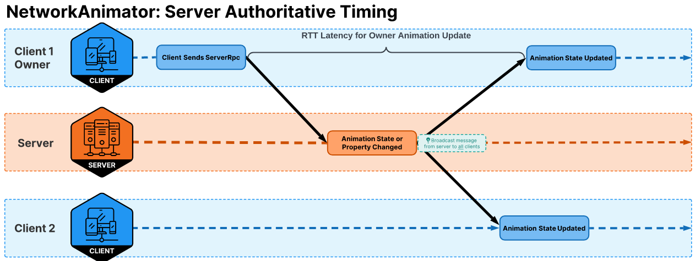
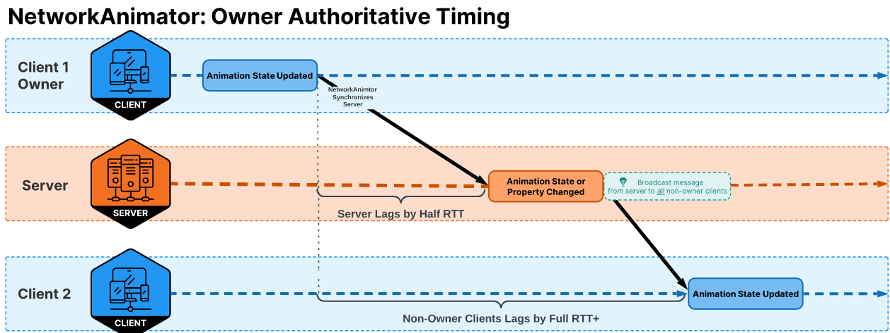
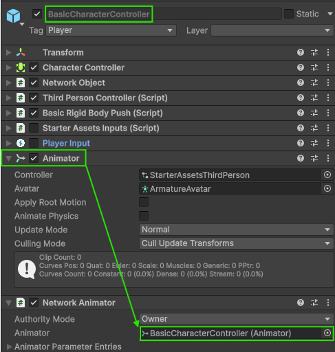
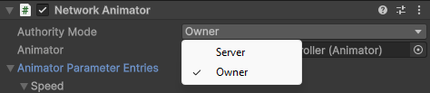
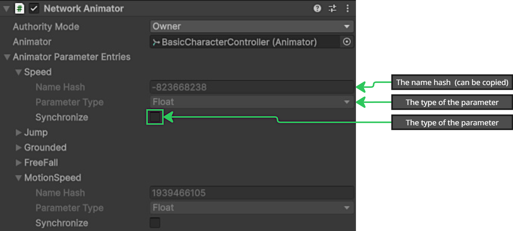
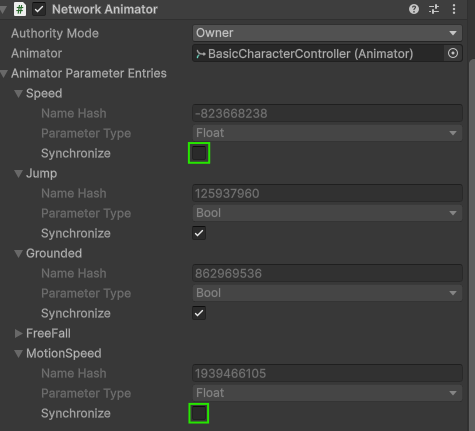
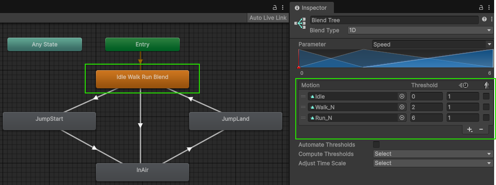

# NetworkAnimator

The NetworkAnimator component provides you with a fundamental example of how to synchronize animations during a network session. Animation states are synchronized with players joining an existing network session and any client already connected before the animation state changing.

* Players joining an existing network session will be synchronized with:
  * All the `Animator`'s current parameters and states.
    * With the following exceptions:
      * `Animator` trigger parameters.
        * _These are only synchronized with already connected clients._
        * _However, late joining clients will get synchronized with the `Animator`'s current state_.
          * Any `Animator` parameter specifically excluded from being synchronized.
    * Any in progress transition.
* Players already connected will be synchronized with changes to `Animator`:
  * States
  * Transitions
  * Parameters
    * NetworkAnimator will only synchronize parameters that have changed since the previous frame's parameter values.
    * Since triggers are similar to an "event," when an `Animator` parameter is set to `true` it will always be synchronized.

NetworkAnimator can operate in two authority modes:

* Server Authoritative (default): Server dictates changes to `Animator` state(s) and/or parameters.
  * _Owner's can still invoke `NetworkAnimator.SetTrigger`._
* Client Authoritative: The owner of the spawned `NetworkObject` dictates changes to `Animator` state(s) and/or parameters.

> [!NOTE]
> You need to include `Unity.Netcode.Components` as a using directive in order to reference components such as NetworkAnimator.

## Server Authoritative Mode

The default setting for NetworkAnimator is server authoritative mode. When operating in server authoritative mode, any animation state changes that are set (triggers) or detected (change in layer, state, or any `Animator` parameters excluding triggers) on the server side will be synchronized with all clients. Because the server initiates any synchronization of changes to an `Animator` 's state, the owner of the NetworkObject associated with the NetworkAnimator can lag by roughly the full round trip time (RTT). Below is a timing diagram to show this:



In the above diagram, a client might be sending the server an RPC to tell the server that the player is performing some kind of action that can change the player's animations (including setting a trigger). Under this scenario, the client sends an RPC to the server (half RTT), the server processes the RPC, the associated `Animator` state changes are detected by the NetworkAnimator (server-side), and then all clients (including the owner client) are synchronized with the changed.

**Server authoritative model benefits:**

* If running a plain server (non-host), this model helps reduce the synchronization latency between all client animations.

**Server authoritative model drawbacks:**

* Hosts will always be "slightly ahead" of all other clients which may or may not be an issue for your project.
* Client owners will experience a latency between performing an action (moving, picking something up, anything that causes an `Animator` state change).

## Owner Authoritative Mode

Usually, your project's design (or personal preference) might require that owners are immediately updated to any `Animator` state changes. The most typical reason would be to give the local player with instantaneous visual (animation) feedback. To create an owner authoritative NetworkAnimator you need to create a new class that's derived from NetworkAnimator, override the `NetworkAnimator.OnIsServerAuthoritative` method, and within the overridden `OnIsServerAuthoritative` method you should return false like in the example provided below:

```csharp
    public class OwnerNetworkAnimator : NetworkAnimator
    {
        protected override bool OnIsServerAuthoritative()
        {
            return false;
        }
    }
```

Looking at the timing for an owner authoritative NetworkAnimator, in the diagram below, you can see that while the owner client gets "immediate visual animation response" the non-owner clients end up being roughly one full RTT behind the owner client and a host would be half RTT behind the owner client.



In the above diagram, it shows that the owner client has an `Animator` state change that's detected by the NetworkAnimator ( `OwnerNetworkAnimator`) which automatically synchronizes the server with the changed state. The server applies the change(s) locally and then broadcasts this state change to all non-owner clients.

**Owner authoritative model benefits:**

* The owner is provided instant visual feedback of `Animator` state changes, which does offer a smoother experience for the local player.

**Owner authoritative model drawbacks:**

* Non-owner clients lag behind the owner client's animation by roughly one full RTT.
* A host lags behind the owner client's animation by roughly half RTT.

> [!NOTE]
> The same rule for setting trigger parameters still applies to owner clients. As such, if you want to programmatically set a trigger then you still need to use `NetworkAnimator.SetTrigger`.

## Using NetworkAnimator

Using NetworkAnimator is a pretty straight forward approach with the only subtle difference being whether you are using a server or owner authoritative model.

> [!NOTE]
> NetworkAnimator is one of several possible ways to synchronize animations during a network session. Netcode for GameObjects provides you with the building blocks (RPCs, NetworkVariables, and Custom Messages) needed to create a completely unique animation synchronization system that has a completely different and potentially more optimized approach. NetworkAnimator is a straight forward approach provided for users already familiar with the `Animator` component and, depending upon your project's design requirements, might be all that you need.

### Changing meshes

When swapping a skinned mesh with another re-parented skinned mesh, you should invoke the `Rebind` method on the `Animator` component (`Animator.Rebind()`).

### Assigning the animator



Upon adding a `NetowrkAnimator` component to a network prefab, you will need to drag and drop the `Animator` component onto the **Animator** field within the inspector view. The `Animator` component can be on the root `GameObject` of the network prefab or a child under the root `GameObject`.

### Selecting the authority mode

The `NetworkAnimator` authority mode determines which instance of a spawned network prefab pushes updates to the `Animator`'s state.

> [!NOTE]
> If you are upgrading from an older version of Netcode for GameObjects, then using this legacy/alternate approach still works and will be honored. The value returned from an overridden `NetworkAnimator.OnIsServerAuthoritative` will be used as opposed to the more recent update where you can just select the authority model within the inspector view.

In earlier versions of Netcode for GameObjects, to change the authority mode of a `NetworkAnimator` you would need to:

* Derive from the `NetworkAnimator` class.
* Override the `NetworkAnimator.OnIsServerAuthoritative` method.
  * Returning `true` would make the server the animator authority.
  * Returning `false` would make the owner the animator authority.

With the updated NetworkAnimator, you now can just select which authority model you want to use from within the inspector view:



> [!NOTE]
> Using the `NetworkAnimator.OnIsServerAuthoritative` still works and will supersede the NetworkAnimator's **Authority Mode** setting.

### Changing Animator parameters

For all `Animator` parameters (except for triggers), you can set them directly via the `Animator` class. As an example, you might want to incorporate a player jumping and need to be able to handle transitioning out of the later portion of the sequence where the player is "falling" from the jump (or falling when walking off of the edge of a platform). You might have a `bool` parameter called "Grounded" that you need to set when the player is not grounded. The straight forward way would be to set the value on the authoritative instance (server or owner) like such:

```csharp
m_Animator.SetFloat("Grounded", false);
```

_(In the above script, `m_Animator` is a reference to the `Animator` component.)_

The above example works, but in reality you would want to pre-calculate the hash value of the parameter's name and use that pre-calculated value to apply updates to parameters. Below provides an example of how you can accomplish this:

```csharp
private int m_GroundedParameterId;
private bool m_WasGrounded;
private Animator m_Animator;
private CharacterController m_CharacterController;

protected override void OnNetworkPreSpawn(ref NetworkManager networkManager)
{
    // Pre-calculate the hash for quick lookup.
    m_GroundedParameterId = Animator.StringToHash("Grounded");
    // Get the CharacterController.
    m_CharacterController = GetComponent<CharacterController>();
}

private void CheckForFalling()
{
    // If the last status of being grounded is not the current.
    if (m_CharacterController.isGrounded != m_WasGrounded)
    {
        // Set the Grounded parameter to match the change in the grounded state.
        m_Animator.SetBool(m_GroundedParameterId, m_CharacterController.isGrounded);
        // Update to be able to detect when it changes back.
        m_WasGrounded = m_CharacterController.isGrounded;
    }
}
```

## Animator trigger parameter

The `Animator` trigger parameter type ("trigger") is basically nothing more than a Boolean value that, when set to `true`, will get automatically reset back to `false` after the `Animator` component has processed the trigger. Usually, a trigger is used to start a transition between `Animator` layer states. In this sense, one can think of a trigger as a way to signal the "beginning of an event". Because trigger parameters have this unique behavior, they **require** that you to set the trigger value via the `NetworkAnimator.SetTrigger` method.

> [!NOTE]
> If you set a trigger parameter using `Animator.SetTrigger` then this trigger sequence/transition won't be properly synchronized with the non-authority clone instances.

An example might be that you use a trigger parameter called `IsJumping` to start a blended transition between the player's walking/running animation and the jumping animation. The below script adds **m_NetworkAnimator** which is assigned during `OnNetworkPreSpawn` (_unless you need to access it in `Start` it is recommended to handle getting components within `OnNetworkPreSpawn` as this will be invoked prior to `Start` when first spawning an instance_).

```csharp
private int m_GroundedParameterId;
private int m_JumpingParameterId;
private bool m_WasGrounded;
private Animator m_Animator;
private NetworkAnimator m_NetworkAnimator;
private CharacterController m_CharacterController;

protected override void OnNetworkPreSpawn(ref NetworkManager networkManager)
{
    // Pre-calculate the hash values for performance purposes.
    m_GroundedParameterId = Animator.StringToHash("Grounded");
    m_JumpingParameterId = Animator.StringToHash("IsJumping");

    // Get the CharacterController.
    m_CharacterController = GetComponent<CharacterController>();
    // Get the NetworkAnimator component.
    m_NetworkAnimator = GetComponent<NetworkAnimator>();
}

private void CheckForFalling()
{
    // If the last status of being grounded is not the current.
    if (m_CharacterController.isGrounded != m_WasGrounded)
    {
        // Set the Grounded parameter to match the change in the grounded state.
        m_Animator.SetBool(m_GroundedParameterId, m_CharacterController.isGrounded);
        // Update to be able to detect when it changes back.
        m_WasGrounded = m_CharacterController.isGrounded;
    }
}

public void SetPlayerJumping(bool isJumping)
{
    // You only need to pass in the parameters hash/id to set the trigger
    m_NetworkAnimator.SetTrigger(m_JumpingParameterId);
}
```

## Excluding parameters from being synchronized

Now that you know about setting the authority mode and changing parameters, it is time to think about which parameters you want synchronized. Initially you might feel that all parameters need synchronization, however NetworkAnimator will synchronize any changes to any parameters marked for synchronization.

This can become most problematic with `float` parameters that change often. As an example, you might have a `float` parameter called "Speed" which dictates the speed at which the current animation is played. This value could be directly set from a player's actual linear velocity which would most definitively be different each frame while a player is walking or running around. The end result is that for each spawned authority instance of any given network prefab that uses this kind of approach would generate at least one RPC per frame and that can exhaust transport resources and generate a bunch of network traffic.

> [!NOTE]
> Taking the above scenario into consideration, if you had 300 spawned instances where each authority instance generated 1 RPC per instance per frame you would generate 300 messages per frame or (if running at 60hz) 18,000 messages per second. While Netcode for GameObjects will batch messages by combining them into a single message, it would still generate (at a minimum) a reliable fragmented sequenced message that is fragmented across ~5 UTP messages per frame. This would lead to latency and performance issues.

Fortunately, NetworkAnimator provides you with the ability to enable or disable any animator parameter from being synchronized within the **Animator Parameter Entries** field:



When expanding this list of parameters, you will note that it also provides the hash value of the parameter's name (which can be copied), the parameter type, and a **Synchronize** field. By default, all parameters are marked for synchronization.

### Non-synchronized parameters

How you want to handle updating parameters that are not synchronized is really dependent upon what kind of approach best fits your project's goals. Fortunately, there are two ways to handle this:

* Synchronize the values using your own custom solution
  * You can opt to send the values at a specific interval via RPC or use a NetworkVariable that will synchronize any delta each network tick.
    * _This still contributes to the over-all bandwidth and processing time, but can provide you with the ability to lerp between the previous and current value over (n) period of time._
* Update the parameters locally based on values that you already have access to.
  * This is the "bandwidth free" approach, but does require some additional script to handle this.

#### Updating locally

Since this option is basically "bandwidth free" and is most likely the first area you might be interested in investigating, we will dive a bit deeper to provide one common parameter that can be handled locally: **Speed**.

The scenario:

* You are using a modified version of the ThirdPersonController or are using a similar approach where you have two parameters that determine how quickly a player might play a walking or running animation:
  * Speed parameter:
    * Updated each frame based on the player's input.
  * MotionSpeed:
    * Basically determines the magnitude of the player's input.
      * _Most of the time this ends up being either 1.0 or 0.0 without an analog device, so the below example assumes you are not using an analog device to control the "amount of speed" to apply over time._
* You are using a NetworkTransform to synchronize changes in position and rotation or you have written your own custom NetworkBehaviour that accomplishes the same thing.
  * You have interpolation enabled or your custom solution uses some form of interpolation where a single state update is applied over (n) period of time (typically a network tick).

Since each non-authority instance will be receiving delta transform state updates from the authority instance, we know that if the authority instance is moving then it is most likely animating and it is playing those animations based on the "speed" (linear velocity) of the authority player instance.

This means we should be able to come up with a way, on the non-authority side, to "mock/calculate" some values based on changes to the transform's position on a frame by frame basis. The first thing we would want to do is mark the two parameters as not being synchronized within the NetworkAnimator's **Animator Parameter Entries** list (for this example):



This means the authority will no longer send updates when these two parameters are marked to not be synchronized. The next thing that needs to be done is to come up with a way to calculate these values on non-authority instances based on the non-authority instances movement over time.

Below is a simple example pseudo/partial script that shows how to accomplishes this:

```csharp
[Range(0.0001f, 1.0f)]
public float m_NonAuthorityMotionThreshold = 0.01f;
private Vector3 m_LastPosition;
private float m_UnitsPerSecond;
private bool m_WasMoving;

// Can be used to toggle parameter synchronization during runtime
private NetworkVariable<bool> m_SynchronizeSpeedParameter = new NetworkVariable<bool>(false);

protected override void OnNetworkPostSpawn()
{
    _controller.enabled = IsLocalPlayer;
    _hasAnimator = TryGetComponent(out _animator);
    if (IsLocalPlayer)
    {
        // Register the authority for both the Update and PostLateUpdate player loop stages
        // Update used to handle input and apply motion.
        NetworkUpdateLoop.RegisterNetworkUpdate(this, NetworkUpdateStage.Update);

        // PostLateUpdate handles camera rotation adjustments
        NetworkUpdateLoop.RegisterNetworkUpdate(this, NetworkUpdateStage.PostLateUpdate);
        _input.enabled = true;
        _playerInput.enabled = true;
        m_SynchronizeSpeedParameter.Value = false;
        m_NetworkAnimator.EnableParameterSynchronization("Speed", m_SynchronizeSpeedParameter.Value);
        m_NetworkAnimator.EnableParameterSynchronization("MotionSpeed", m_SynchronizeSpeedParameter.Value);
    }
    else
    {
        // When a non-authority instance is spawned, it initializes the last known position
        m_LastPosition = transform.position;

        // Non-authority instances register for the pre-late update to assure any adjustments to
        // position have been applied before calculating the animation speed.
        NetworkUpdateLoop.RegisterNetworkUpdate(this, NetworkUpdateStage.PreLateUpdate);

    }
    base.OnNetworkPostSpawn();
}

public override void OnNetworkPreDespawn()
{
    _controller.enabled = false;
    // Before de-spawning, unregister from all updates for this instance
    NetworkUpdateLoop.UnregisterAllNetworkUpdates(this);
    base.OnNetworkPreDespawn();
}

// This class implements INetworkUpdateSystem
public void NetworkUpdate(NetworkUpdateStage updateStage)
{
    if (!IsSpawned)
    {
        return;
    }

    switch (updateStage)
    {

        case NetworkUpdateStage.Update:
            {
                // Authority only
                AuthorityUpdate();
                break;
            }
        case NetworkUpdateStage.PreLateUpdate:
            {
                if (!m_SynchronizeSpeedParameter.Value)
                {
                    // Non-authority only
                    NonAuthorityUpdate();
                }
                else if (m_WasMoving)
                {
                    // If synchronizing speed and we were moving, then
                    // reset the fields used to calculate speed
                    m_WasMoving = false;
                    m_UnitsPerSecond = 0.0f;
                    _animationBlend = 0.0f;
                    _speed = 0.0f;
                }
                break;
            }
        case NetworkUpdateStage.PostLateUpdate:
            {
                // Authority only
                CameraRotation();
                break;
            }
    }
}

private void NonAuthorityUpdate()
{
    // Get the delta from last frame
    var deltaVector3 = transform.position - m_LastPosition;
    // An approximated calculation of the potential unity world space units per second by getting the quotient of delta time divided into 1. We are only interested in x and z deltas, so use a Vector2, and then obtain the magnitude of the quotient times the Vector2.
    var unitsPerSecond = (new Vector2(deltaVector3.x, deltaVector3.z) * (1.0f / Time.deltaTime)).magnitude;

    // Only trigger when the delta per frame exceeds the non-authority motion threshold
    if (unitsPerSecond > m_NonAuthorityMotionThreshold)
    {
        // if the new delta is > or < the last value stored
        if (unitsPerSecond != m_UnitsPerSecond)
        {
            // Lerp towards the new delta to mock the player input
            m_UnitsPerSecond = Mathf.Lerp(m_UnitsPerSecond, unitsPerSecond, Time.deltaTime * SpeedChangeRate);

            // Clamp to the maximum world space units per second
            m_UnitsPerSecond = Mathf.Clamp(m_UnitsPerSecond, 0.0f, SprintSpeed);

            // round speed to 3 decimal places like it does with player input
            _speed = (float)System.Math.Round(m_UnitsPerSecond, 3);

            // Track that we are now moving
            m_WasMoving = true;
        }
        else
        {
            // Maintain the current speed
            _speed = m_UnitsPerSecond;
        }

        // If we are half of the non-authority motion threshold then come to a stop
        if (_speed < (m_NonAuthorityMotionThreshold * 0.5f))
        {
            _speed = 0f;
            m_UnitsPerSecond = 0f;
            // Reset the magnitude to zero
            _animator.SetFloat(_animIDMotionSpeed, 0.0f);
        }
        else
        {
            // Set maximum magnitude
            _animator.SetFloat(_animIDMotionSpeed, 1.0f);
        }
        // Apply the calculated speed value
        _animator.SetFloat(_animIDSpeed, _speed);

    }
    else if (m_WasMoving)
    {
        // Reset everything until next motion
        m_WasMoving = false;
        _animator.SetFloat(_animIDSpeed, 0.0f);
        _animator.SetFloat(_animIDMotionSpeed, 0.0f);
        m_UnitsPerSecond = 0.0f;
        _animationBlend = 0.0f;
        _speed = 0.0f;
    }
    m_LastPosition = transform.position;
}
```

**The walk through:**

* It keeps track of the last known position.
  * This is initialized on non-authority instances during post spawn.
* The delta between the last known position and current position is used to determine what our world units per second would be if we maintained that same delta for one second.
  * _This could be improved, but provides a reasonably close approximation._
* We then make sure the (world) units per second exceeds a specific threshold to avoid edge cases.
* If the units per second is larger than the threshold:
  * Lerping from the last known units per second value towards the new/current units per second value.
    * _This handles "accelerating" towards or away from the current value._
  * Clamp the calculated value to the maximum speed.
  * Round the result and assign it to the "_speed" field (from ThirdPersonController).
* Check if the currently known speed is less than a predetermined minimum value.
  * _If so, then set the speed and motion speed to zero._
* Update the local Animator's **Speed** and **MotionSpeed** parameters.

The end result is that (NetworkAnimator relative) the only time this particular setup would send RPCs would be if the player jumps or falls since speed dictates the idle, walking, and running animations:



### Update a parameter's synchronize during runtime

You might have noticed a mention of toggling the **Speed** parameter's synchronize value during runtime. Perhaps you have a lot of already existing network prefab assets that might be too time intensive to adjust or you might only want certain instances adjusted. Either case, you can update the synchronization status of a parameter on the authority instance by invoking `NetworkAnimator.EnableParameterSynchronization`.

Below is an example script that does this when the backslash key is pressed:

```csharp
if (Input.GetKeyDown(KeyCode.Backslash))
{
    m_SynchronizeSpeedParameter.Value = !m_SynchronizeSpeedParameter.Value;
    m_NetworkAnimator.EnableParameterSynchronization(_animIDSpeed, m_SynchronizeSpeedParameter.Value);
    m_NetworkAnimator.EnableParameterSynchronization(_animIDMotionSpeed, m_SynchronizeSpeedParameter.Value);
}
```
