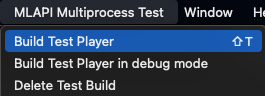
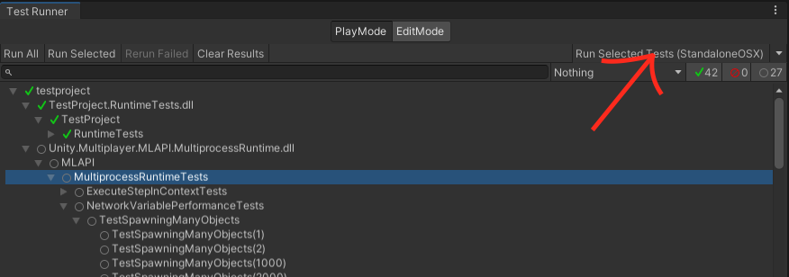

# Multiprocess testing

## Why
Multiprocess testing can be used for different use cases like 
- integration tests (MLAPI + actual transport for example)
- performance testing. 
- Anything requiring a more realistic environment for testing that involves having a full client and server, communicating on a real network interface using real transports in separate Unity processes.


## How to write a multiprocess test
There's a few steps to write a multiprocess test

1. Your test class needs to inherit from `BaseMultiprocessTests`
2. Each test method needs the `MultiprocessContextBasedTest` attribute
3. Each test method needs to run `InitContextSteps();`
4. Each context based step needs to use 
```C#
yield return new ExecuteStepInContext(StepExecutionContext.Clients, stepToExecute: nbObjectsBytes => {
    // Something here
});
```

If you want to pass in dynamic test parameters (for example nunit `Values`), you need to pass them as a `byte[]` parameter to your step, since remote execution won't have context capture from the test execution and you won't see the test's parameters.


## How to run a test locally
Test players need to be built first to test locally. Integration with CI should do this automatically.



Then run the tests.

Performance tests should only be run from external processes (not from editor). This way the server code will run in a build, just as much as client code.



## How it's done
### Multiple processes orchestration
todo 
#### Local orchestration
#### Bokken orchestration
### CI
todo
#### Performance report dashboards
todo
### Client-server test coordination
todo
### Context based step execution
todo

# Future considerations
- Integrate with local MultiInstance tests?
- Have ExecuteStepInContext a game facing feature for sequencing client-server actions?