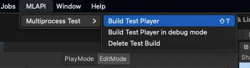

# Multiprocess testing

## Why
Multiprocess testing can be used for different use cases like 
- integration tests (MLAPI + actual transport or multi-scene testing for example)
- performance testing. 
- Anything requiring a more realistic environment for testing that involves having a full client and server, communicating on a real network interface using real transports in separate Unity processes.

The tests you write and test locally will be deployed dynamically to bokken instances. The tests shouldn't have to worry about what hardware it runs on, this should be abstracted away by "workers" and "coordinator".

## How to write a multiprocess test
There's a few steps to write a multiprocess test

1. Your test class needs to inherit from `BaseMultiprocessTests`
2. Each test method needs the `MultiprocessContextBasedTest` attribute
3. Each test method needs to run `InitializeContextSteps();`
4. Each context based step can use
```cs
yield return new ExecuteStepInContext(StepExecutionContext.Clients, stepToExecute: nbObjectsBytes => {
    // Something here
});
```
A test method would look like
```cs
    [UnityTest, MultiprocessContextBasedTest]
    public IEnumerator MyTest()
    {
        InitializeContextSteps(); // the only call that should be made outside of context based tests
        yield return new ExecuteStepInContext(StepExecutionContext.Server, bytes =>
        {
            Debug.Log("server stuff");
        });
        yield return new ExecuteStepInContext(StepExecutionContext.Clients, bytes =>
        {
            Debug.Log("client stuff");
            Assert.That(1, Is.EqualTo(1));
            throw new Exception("asdf"); // this client side exception will be communicated to the coordinator, making the test fail
        });
    }
```
Your test code shouldn't execute outside of these steps (as that test method can be executed multiple times, once for step registration and once for the actual test run for example)

Another way to write a multiprocess test without context based steps is to use TestCoordinator directly.
```cs
    private static void ExecuteSimpleCoordinatorTest()
    {
        TestCoordinator.Instance.WriteTestResultsServerRpc(float.PositiveInfinity);
    }

    [UnityTest]
    public IEnumerator CheckTestCoordinator()
    {
        // Call the client side method
        TestCoordinator.Instance.InvokeFromMethodActionRpc(ExecuteSimpleCoordinatorTest);

        var resultCount = 0;
        for (int i = 0; i < WorkerCount; i++) // wait and test for the two clients
        {
            yield return new WaitUntil(TestCoordinator.ResultIsSet());

            var (clientId, result) = TestCoordinator.ConsumeCurrentResult().Take(1).Single();
            Assert.Greater(result, 0f);
            resultCount++;
        }

        Assert.That(resultCount, Is.EqualTo(WorkerCount));
    }
```

Here's a complete set of examples using the API

```cs
using System;
using System.Collections;
using System.Collections.Generic;
using NUnit.Framework;
using Unity.PerformanceTesting;
using UnityEngine;
using UnityEngine.Profiling;
using UnityEngine.TestTools;
using static ExecuteStepInContext;

namespace Unity.Netcode.MultiprocessRuntimeTests
{
    public class DemoProcessTest : BaseMultiprocessTests
    {
        protected override int WorkerCount { get; } = 2; // spawns 2 clients connecting to the test runner
        protected override bool m_IsPerformanceTest { get; } = false; // specifies whether this should execute from editor or not

        [UnityTest, MultiprocessContextBasedTest] // attribute necessary for context based step execution
        public IEnumerator MyTest()
        {
            InitializeContextSteps(); // necessary to initialize context based steps

            // These steps execute sequentially.
            yield return new ExecuteStepInContext(StepExecutionContext.Server, bytes =>
            {
                Debug.Log("server stuff");
            });
            // for example, the test runner will yield on the same step until clients all report they are done with this step. Once all clients report they are done, the test can continue to the same step.
            yield return new ExecuteStepInContext(StepExecutionContext.Clients, bytes =>
            {
                Debug.Log("client stuff");
                Assert.That(1, Is.EqualTo(1));
                throw new Exception("asdf"); // this client side exception will be communicated to the coordinator, making the test fail
            });

            yield return new ExecuteStepInContext(StepExecutionContext.Clients, bytes =>
            {
                // To write results to the test runner, call this method:
                TestCoordinator.Instance.WriteTestResultsServerRpc(123);
                TestCoordinator.Instance.WriteTestResultsServerRpc(123);
                TestCoordinator.Instance.WriteTestResultsServerRpc(123); // could be replaced by json string instead for ease of use?
            });
            yield return new ExecuteStepInContext(StepExecutionContext.Server, bytes =>
            {
                // consumes first result sent above from any client
                TestCoordinator.ConsumeCurrentResult();
                // consumes all results from all clients
                foreach (var (clientID, result) in TestCoordinator.ConsumeCurrentResult())
                {
                    Assert.That(result, Is.EqualTo(123));
                }
                // consumes results for individual clients
                foreach (var clientID in TestCoordinator.AllClientIdsExceptMine)
                {
                    TestCoordinator.ConsumeCurrentResult(clientID);
                }
            });

            int someValue = 456; // one caveat to executeStepInContext is contrary to instinct, this is not shared between server and client execution.
            // to send that value to clients, "paramToPass" needs to be used
            yield return new ExecuteStepInContext(StepExecutionContext.Clients, bytes =>
            {
                var valueComingFromServer = BitConverter.ToInt32(bytes, 0);
            }, paramToPass: BitConverter.GetBytes(456)); // could be replaced by JSON string instead for ease of use?
            // useful for taking in [Values] method parameters as these are only known by the server

            // when you have client steps that take more than one frame, you can subscribe to the OnUpdate callback on CallbackComponent
            yield return new ExecuteStepInContext(StepExecutionContext.Clients, bytes =>
            {
                void Update(float _)
                {
                    NetworkManager.Singleton.gameObject.GetComponent<CallbackComponent>().OnUpdate -= Update;
                    TestCoordinator.Instance.ClientFinishedServerRpc(); // since finishOnInvoke is false, we need to do this manually
                }
                NetworkManager.Singleton.gameObject.GetComponent<CallbackComponent>().OnUpdate += Update;
            }, waitMultipleUpdates: true); // this keeps waiting "are you done? are you done? are you done?" and relies on the clients calling the "ClientFinishedServerRpc"

            yield return new ExecuteStepInContext(StepExecutionContext.Clients, bytes =>
            {
                int cpt = 0;
                void Update(float _)
                {
                    TestCoordinator.Instance.WriteTestResultsServerRpc(Time.time);
                }
                NetworkManager.Singleton.gameObject.GetComponent<CallbackComponent>().OnUpdate += Update;
            }, additionalIsFinishedWaiter: () => // this keeps waiting "are you done? are you done? are you done?" until this lambda returns true
            {
                foreach (var (clientId, latest) in TestCoordinator.ConsumeCurrentResult())
                {
                    return latest >= 10;
                }
                return false;
            });
        }

        [UnityTest, Performance] // already existing performance framework https://docs.unity3d.com/Packages/com.unity.test-framework.performance@2.8/manual/index.html
        public IEnumerator PerfTest()
        {
            var totalAllocSampleGroup = new SampleGroup("GC Alloc", SampleUnit.Kilobyte);
            var allocStat = Profiler.GetTotalAllocatedMemoryLong();
            Measure.Custom(totalAllocSampleGroup, allocStat / 1024); // this will record in Unity's shared Performance DB.
            // Dashboards will be able to display these stats overtime
            yield return null;
        }
    }
}


```


## How to run a test
**Local**: Test players need to be built first to test locally. 

**Automated**: Integration with CI should do this automatically.



Then run the tests from Unity's test runner.

Note that performance tests should be run from external processes (not from editor). This way the server code will run in a build, just as much as client code, for more realistic test results.


## How it's done
### Multiple processes orchestration
The test runner executes the main node's tests. The tests are in charge of launching their needed workers.
With the bokken integration, we'll need to be careful about ressource contention at Unity, these tests could be heavy on ressources.
Tests when launched locally will simply create new OS processes for each worker players.


*Note that this diagram is still WIP for the CI part*
### Bokken orchestration
todo
### CI
todo
#### Performance report dashboards
todo
### Client-server test coordination
A Test Coordinator is in charge of managing communication between the nodes, executing remote test code. The test coordinator is also in charge of process cleanup, if for example the server crashes, so we don't have zombie clients laying around.
The test coordinator in client mode will automatically try to connect to a server on Start().
### Context based step execution
Test methods are executed twice. Once in "registration" mode, to have all the steps register themselves using a unique ID. This ID is deterministic between client and server processes, so that when a server calls a step during actual test execution, the clients have the same ID associated with the same lambda.
During test execution, the main node's step will call an RPC on clients to trigger their pre-registered lambda. The main node's step will then yield until it receives a "client done" RPC from all clients. The main node's test will then be able to continue execution to the next step.

# Future considerations
- Integrate with local MultiInstance tests?
- Have ExecuteStepInContext a game facing feature for sequencing client-server actions?